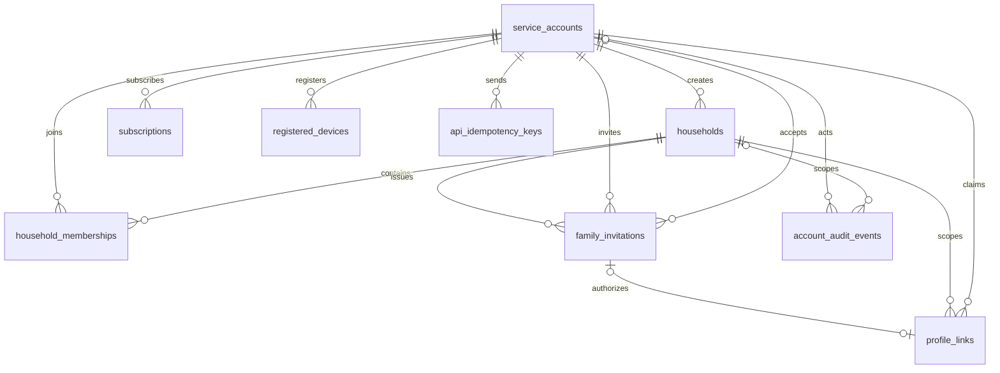
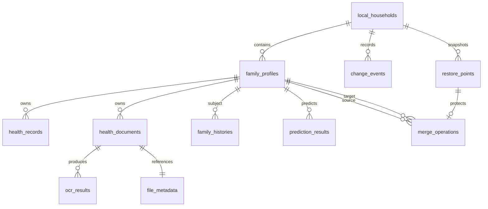

# 데이터 모델 — PostgreSQL 서버와 브라우저 로컬 분리

> 상태: PostgreSQL 17 목표 모델 1.0 초안
>
> 실행 가능한 서버 DDL: [0002_service_domain.sql](database/0002_service_domain.sql)
>
> 서버 API: [03_api_spec.md](03_api_spec.md), [OpenAPI 3.1](api/openapi.yaml)
>
> 로컬 물리 스키마: [10_local_data_contract.md](10_local_data_contract.md)
> 아키텍처 결정: [ADR-001](adr/0001-web-local-first-architecture.md)

## 1. 물리적 경계

```text
PostgreSQL
  계정·인증 세션·구독·가정 컨테이너·초대·불투명 프로필 연결

IndexedDB + OPFS
  가족 프로필·건강기록·가족력·통증·원본 서류·OCR·예측·변경 이력
```

PostgreSQL과 브라우저 로컬 데이터 사이에는 외래키가 없다. 서버의 `local_profile_ref`는 브라우저가 만든 무작위 불투명 값이며 프로필의 이름·생년·관계·건강정보를 복원할 수 없어야 한다.

## 2. PostgreSQL ERD



### 2.1 `service_accounts`

로그인·구독·초대에 사용하는 최소 서비스 계정이다. 가족 구성원 프로필 내용은 포함하지 않는다.

| 컬럼 | PostgreSQL | Null | 기본값 | 규칙 |
|---|---|---:|---|---|
| `id` | uuid | N | UUID v4 | PK |
| `email` | varchar(320) | N | 없음 | `lower(email)` 유일 |
| `password_hash` | varchar(255) | N | 없음 | 검증된 비밀번호 해시 문자열 |
| `status` | varchar(20) | N | active | active, suspended, closed |
| `closed_at` | timestamptz | Y | 없음 | 계정 폐쇄 시각 |
| `row_version` | bigint | N | 1 | 낙관적 잠금 |
| `created_at` | timestamptz | N | now | 생성 시각 |
| `updated_at` | timestamptz | N | now | 트리거 갱신 |

이름, 성별, 생년, 전화번호와 건강정보는 서비스 계정에 저장하지 않는다. Refresh Token 상태는 PostgreSQL이 아니라 Redis의 만료·회전 저장소에서 관리한다.

### 2.2 `households`

초대와 연결을 묶는 서버 컨테이너다. 표시 이름·주소·가족관계를 저장하지 않는다.

| 컬럼 | 타입 | 규칙 |
|---|---|---|
| `id` | uuid PK | 서버 가정 ID |
| `created_by_account_id` | uuid FK | 생성 계정, restrict |
| `status` | varchar(16) | `active`, `closed` |
| `closed_at` | timestamptz nullable | closed에서만 필수 |
| `row_version` | bigint | 낙관적 잠금 |
| `created_at` / `updated_at` | timestamptz | 감사 시각 |

### 2.3 `household_memberships`

서비스 계정의 가정 참여 상태다. 건강정보 접근 범위나 관리자 역할을 뜻하지 않는다.

| 컬럼 | 타입 | 규칙 |
|---|---|---|
| `id` | uuid PK | 멤버십 ID |
| `household_id` | uuid FK | 가정 삭제 시 cascade |
| `account_id` | uuid FK | 계정 삭제 시 cascade |
| `status` | varchar(16) | `active`, `left` |
| `joined_at` / `left_at` | timestamptz | 상태와 CHECK로 결합 |
| `row_version` | bigint | 낙관적 잠금 |
| `created_at` / `updated_at` | timestamptz | 감사 시각 |

유일성: `(household_id, account_id)`.

### 2.4 `subscriptions`

| 컬럼 | 타입 | 규칙 |
|---|---|---|
| `id` | uuid PK | 구독 ID |
| `account_id` | uuid FK | 결제 서비스 계정 |
| `provider` | varchar(24) | internal, stripe, app_store, play_store |
| `provider_customer_ref` | varchar(255) nullable | 결제사 고객 ID |
| `provider_subscription_ref` | varchar(255) nullable | 결제사 구독 ID, 제공자와 함께 유일 |
| `plan_code` | varchar(40) | 내부 플랜 코드 |
| `status` | varchar(20) | trialing, active, past_due, cancelled, expired |
| `current_period_start/end` | timestamptz nullable | 종료가 시작보다 이후 |
| `cancel_at_period_end` | boolean | 기간 종료 취소 여부 |
| `cancelled_at` | timestamptz nullable | 취소 시각 |
| `row_version` | bigint | 낙관적 잠금 |

부분 유일 인덱스로 한 계정에 `trialing|active|past_due` 구독을 최대 하나만 허용한다.

### 2.5 `family_invitations`

| 컬럼 | 타입 | 규칙 |
|---|---|---|
| `id` | uuid PK | 초대 ID |
| `household_id` | uuid FK | 초대 대상 가정 |
| `inviter_account_id` | uuid FK | 초대한 계정 |
| `invitee_email` | varchar(320) | 초대 이메일 |
| `target_profile_ref` | varchar(86) | 43~86자 base64url 불투명 값 |
| `token_hash` | bytea | 초대 토큰 SHA-256 32바이트, 유일 |
| `status` | varchar(16) | pending, accepted, declined, expired, cancelled |
| `expires_at` | timestamptz | 생성보다 이후 |
| `accepted_by_account_id` | uuid FK nullable | 수락 계정 |
| `accepted_at` / `declined_at` / `cancelled_at` | timestamptz nullable | 종료 상태와 CHECK로 결합 |
| `row_version` | bigint | 낙관적 잠금 |

부분 유일 인덱스:

```sql
UNIQUE (household_id, lower(invitee_email), target_profile_ref)
WHERE status = 'pending'
```

### 2.6 `profile_links`

| 컬럼 | 타입 | 규칙 |
|---|---|---|
| `id` | uuid PK | 연결 ID |
| `household_id` | uuid FK | 가정 범위 |
| `account_id` | uuid FK | 서비스 계정 |
| `invitation_id` | uuid FK unique nullable | 연결 근거 초대 |
| `local_profile_ref` | varchar(86) | 불투명 프로필 참조값 |
| `status` | varchar(16) | active, unlinked |
| `linked_at` / `unlinked_at` | timestamptz | 상태와 CHECK로 결합 |
| `row_version` | bigint | 낙관적 잠금 |

활성 상태에서 다음 두 제약을 동시에 적용한다.

```sql
UNIQUE (household_id, account_id) WHERE status = 'active';
UNIQUE (household_id, local_profile_ref) WHERE status = 'active';
```

따라서 같은 가정에서 한 계정은 한 프로필에만 연결되고 한 프로필 참조값도 한 계정만 점유한다.

### 2.7 `registered_devices`

WebRTC 기술검증 후에만 API에서 사용한다. 현재 DDL에는 후순위 스키마 예약으로 존재한다.

| 허용 | 금지 |
|---|---|
| 무작위 `device_ref` | 건강정보·파일 암호문 |
| 사용자 지정 기기 표시명 | 프로필 이름·생년·관계 |
| 플랫폼·브라우저 계열 | OCR·예측 결과 |
| 공개키 JWK | 개인키·복호화 키 |
| 마지막 연결 시각 | 건강정보 기반 통계 |

### 2.8 `api_idempotency_keys`

`(account_id, operation, idempotency_key)`가 PK다. 요청 SHA-256, 상태 코드와 비민감 응답을 24시간 저장한다. 비밀번호, 토큰과 건강정보를 저장하지 않는다.

### 2.9 `account_audit_events`

계정·구독·초대·연결 상태 변경만 기록한다. `metadata jsonb`에는 건강정보를 넣을 수 없으며 코드 리뷰와 DTO allowlist로 통제한다.

## 3. PostgreSQL 무결성 규칙

### 3.1 DB가 직접 보장하는 규칙

- 이메일 대소문자 무시 유일성
- 계정별 활성 구독 최대 1개
- 대기 초대 중복 방지
- 초대 상태와 종료 시각 일치
- 같은 가정에서 계정별 활성 프로필 연결 최대 1개
- 같은 가정에서 프로필 참조값별 활성 계정 최대 1개
- UUID FK와 삭제 정책
- `row_version` 자동 증가와 `updated_at` 갱신

### 3.2 애플리케이션 트랜잭션이 보장하는 규칙

- 초대자는 가정의 활성 구성원이어야 한다.
- 초대 수락 이메일과 현재 로그인 이메일이 일치해야 한다.
- 프로필 연결의 참조값과 초대의 대상 참조값이 일치해야 한다.
- 초대 수락자와 프로필 연결 계정이 동일해야 한다.
- 다른 활성 구성원이 있으면 가정을 폐쇄하지 않는다.
- 계정·구독 상태 변경의 결제사 이벤트 순서를 검증한다.

Cross-row 규칙을 다른 행을 조회하는 `CHECK`로 만들지 않고 트랜잭션 잠금, FK, 유일 인덱스로 구현한다.

## 4. 삭제 정책

| 엔티티 | 기본 삭제 | 이유 |
|---|---|---|
| `service_accounts` | `status=closed`, `closed_at` 기록 | 세션·결제 정산과 감사 추적 |
| `households` | `status=closed` | 연결 이력 보존 |
| `household_memberships` | `status=left` | 참여 이력 보존 |
| `family_invitations` | 종료 상태 전환 | 초대 상태 추적 |
| `profile_links` | `status=unlinked` | 재연결·감사 추적 |
| `api_idempotency_keys` | 24시간 후 물리 삭제 | 재시도 창 종료 |
| `account_audit_events` | 보존정책 후 익명화·삭제 | 개인정보 최소화 |

서비스 계정 또는 서버 연결을 삭제해도 브라우저의 건강정보는 자동 삭제되지 않는다.

## 5. 브라우저 로컬 ERD



로컬 엔티티의 필드, 암호화 형식, IndexedDB object store와 인덱스는 [10_local_data_contract.md](10_local_data_contract.md)를 기준으로 한다.

## 6. 서버와 로컬 참조 매핑

```text
PostgreSQL profile_links.local_profile_ref
                 │ 동일한 무작위 문자열
                 ▼
IndexedDB profiles.opaqueServerRef
```

- 서버는 로컬 `profileId`를 알지 못한다.
- 브라우저는 `opaqueServerRef → profileId` 매핑을 로컬에서만 해석한다.
- 참조값은 최소 256비트 무작위 값이다.
- 참조값에 프로필 내용을 암호화·해시·인코딩하지 않는다.
- 연결 해제한 참조값을 새 프로필에 재사용하지 않는다.

## 7. 마이그레이션 적용 순서

1. 기존 `20260818_0001_create_users`를 적용한다.
2. 현재 가입 데이터에서 이메일 대소문자 중복과 전화번호 중복을 검사한다.
3. [0002_service_domain.sql](database/0002_service_domain.sql)을 staging DB에 적용한다.
4. SQLAlchemy 모델과 Alembic 0002 마이그레이션을 DDL과 동일하게 작성한다.
5. OpenAPI 계약 테스트와 DB 제약 테스트를 실행한다.
6. 프로덕션 적용 전 `pg_dump --schema-only` 결과를 이 문서와 대조한다.

직접 SQL을 프로덕션에 실행하는 것보다 동일 DDL을 Alembic revision으로 옮겨 배포하는 방식을 권장한다. SQL 파일은 정확한 목표 스키마와 staging 검증용 원본이다.

## 8. 검증 쿼리

```sql
-- 서버에 건강정보로 의심되는 컬럼이 생겼는지 이름 기반 1차 검사
SELECT table_name, column_name
FROM information_schema.columns
WHERE table_schema = 'public'
  AND column_name ~* '(health|disease|diagnosis|pain|ocr|prediction|birth_date|relationship)';

-- 활성 프로필 연결 중복 검사: 결과가 없어야 한다.
SELECT household_id, account_id, count(*)
FROM profile_links
WHERE status = 'active'
GROUP BY household_id, account_id
HAVING count(*) > 1;

-- 만료됐지만 pending으로 남은 초대 정리 대상
SELECT id, expires_at
FROM family_invitations
WHERE status = 'pending' AND expires_at <= now();
```

첫 번째 쿼리는 이름 기반 보조 검사일 뿐이며 JSON·로그·Redis·요청 본문에 건강정보가 없는지는 별도 테스트해야 한다.
