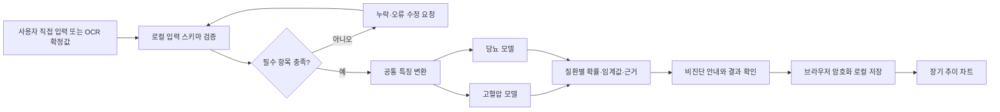
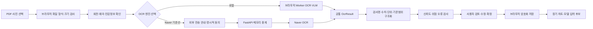
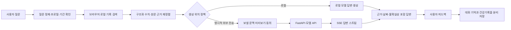

# 핵심 피처 공백 분석 및 멘토링 실행 계획

> 상태: 다음 멘토링 준비용 실행 문서
>
> 기준일: 2026-08-21
>
> 근거: 2026-08-21 프로젝트 멘토 피드백
>
> 관련 문서: [요구사항](01_requirements.md), [기술 아키텍처](05_tech_architecture.md), [만성질환 모델 계획](09_chronic_disease_model_plan.md), [로컬 데이터 계약](10_local_data_contract.md), [로컬 모델 런타임](11_local_model_runtime_implementation.md), [화면·API 구현 지도](13_screen_api_implementation_map.md), [OCR 대체 챌린지](16_ocr_cloud_baseline_local_replacement_challenge.md), [ADR-001 웹 로컬 우선 전환](adr/0001-web-local-first-architecture.md), [ADR-008 임시 클라우드 OCR](adr/0008-temporary-cloud-ocr-baseline.md)

이 문서는 멘토 피드백을 현재 이어봄의 설계와 구현 상태에 연결하고, 다음 멘토링까지 설명 가능한 핵심 피처 흐름과 결정 과제를 준비하기 위한 작업 기준이다.

이 문서는 ADR이 아니다. 기존 ADR을 변경하지 않으며, 아직 승인하지 않은 제안은 `권장안` 또는 `미결정`으로 표시한다. 정책과 아키텍처 경계를 변경해야 하는 결정은 별도 ADR로 확정한다.

## 1. 멘토 피드백 요약

### 1.1 프로젝트 핵심 피처

- 웹 전환을 기준으로 다음 세 축이 각각 어떤 문제를 해결하는지 선명하게 정의한다.
  - 만성질환 예측
  - 의료 이미지 인식
  - 개인 이력 기반 챗봇·RAG
- 화면 수를 늘리기 전에 각 피처의 `사용자 입력 → 데이터 탐색·처리 → 결과 출력` 사이에 남은 공백을 채운다.
- 각 핵심 피처를 완벽하지 않아도 설명할 수 있는 흐름도로 만든다.

### 1.2 모델과 이미지 처리

- 고혈압·당뇨 모델을 각각 운영할지, 앞단 분류기 또는 앙상블로 라우팅할지 조기에 결정한다.
- OCR 전용 파이프라인과 멀티모달 모델 직접 입력 방식의 차이를 결정한다.
- 로컬 모델은 보안뿐 아니라 홈서버 운영, 처리량, 품질, 비용과 사용자 경험을 함께 비교한다.

### 1.3 챗봇

- RAG를 단순 문서 청크 검색이 아니라 사용자별 과거 이력을 기억하고 필요한 시점에 꺼내 쓰는 구조로 설계한다.
- 대화 기억, 잘못된 입력 정제, 검색 방식과 결과 근거를 함께 설계한다.
- 사용자의 질문에만 반응하지 않고 주기적 확인과 선제 알림이 필요한 시나리오를 검토한다.

### 1.4 아키텍처와 협업

- 일반적인 서버 경로는 `웹 → FastAPI → PostgreSQL → 모델 서버`로 설명한다.
- 긴 작업은 워커·Redis, 챗봇 응답 스트리밍은 SSE 적용 가능성을 검토한다.
- 팀원이 서로 다른 AI 도구를 사용해도 결과가 흔들리지 않도록 공통 계획·검토·실행 절차와 프로젝트 규칙을 맞춘다.

## 2. 이어봄에 적용할 때 먼저 지켜야 할 경계

멘토가 설명한 서버 흐름은 일반적인 웹 서비스 구조로 타당하지만, 이어봄은 건강정보를 서버에 저장하지 않는 로컬 우선 정책을 이미 승인했다. 따라서 모든 피처를 하나의 서버 경로로 밀어 넣지 않는다.

| 데이터·작업 | 기준 처리 위치 | 서버 허용 범위 |
| --- | --- | --- |
| 서비스 계정·구독·가정·초대 | FastAPI·PostgreSQL·Redis | 현재 서버 계약에 따라 저장 가능 |
| 가족 구성원 건강 프로필 | 브라우저 암호화 로컬 보관함 | 불투명 연결 참조 외 원문 저장 금지 |
| 건강기록·가족력·장기 차트 | 브라우저 IndexedDB·OPFS | 원문·집계값 자동 업로드 금지 |
| 경량 만성질환 추론 | 브라우저 Worker 우선 | 서버 추론은 새 데이터 정책 결정 필요 |
| Naver OCR 기준선 | 명시적 동의 후 FastAPI 메모리 중계 | 합성·비식별 입력만 허용, DB·Redis·로그 비저장 |
| OCR 작업 상태 | Redis 사용 가능 | 작업 ID·상태·만료 시각만 저장 |
| 개인 이력 RAG 검색 | 브라우저 로컬 우선 | 외부 모델에 전달할 내용은 별도 동의·정책 필요 |

### 적용 원칙

- Redis의 짧은 TTL은 건강정보의 외부 전송이나 서버 저장을 정당화하지 않는다.
- 워커는 작업 시간이 길고 재시도·복구가 필요할 때만 도입한다.
- SSE는 스트리밍 또는 진행 상태가 실제 사용자 경험을 개선할 때만 사용한다.
- 17 KB 수준의 현재 로지스틱 회귀 모델처럼 즉시 실행되는 로컬 추론에는 서버 워커·Redis가 필요하지 않다.
- 서버 모델이 필요한 경우 입력 데이터의 범위, 저장·로그·폐기, 사용자 동의와 실패 처리를 먼저 결정한다.

## 3. 핵심 피처 A — 만성질환 위험 모델

### 3.1 해결하려는 문제

사용자가 입력하거나 건강문서에서 확정한 기초 정보를 바탕으로 질환별 위험 신호를 이해하고, 어떤 입력이 결과에 영향을 주었는지 확인할 수 있게 한다.

결과는 진단이나 치료 지시가 아니다. 현재 BRFSS 기준선은 미래 발병을 예측하는 임상 모델이 아니라, 응답자가 의료진에게 질환을 진단받았다고 보고할 가능성을 추정하는 연구용 모델이다.

### 3.2 현재 상태와 공백

이미 구현된 기준선:

- 공통 특징 처리기와 학습 함수
- 질환별 독립 이진 분류기 11개
- 질환별 임계값·평가 결과·manifest
- BRFSS 표본 가중치와 주 단위 분할 평가
- 로컬 실행에 적합한 작은 모델 크기

남은 공백:

- 멘토가 언급한 **고혈압 모델은 현재 11개 타깃에 포함되지 않는다.**
- 현재 모델의 입력 항목과 실제 서비스 입력 화면이 연결되지 않았다.
- Python `joblib` 산출물을 브라우저에서 실행할 최종 런타임 계약이 확정되지 않았다.
- 위험도, 임계값, 근거, 불확실성과 비진단 문구를 보여 주는 출력 계약이 없다.
- 사용자가 입력을 수정했을 때 재추론하고 이전 결과를 어떻게 다룰지 정하지 않았다.
- 연구용 모델과 사용자 노출 모델의 승인 기준이 분리되지 않았다.

### 3.3 모델 구조 권장안

질환 선택용 앞단 분류기는 두지 않는다. 고혈압과 당뇨는 동시에 존재할 수 있어 하나만 선택하는 상호 배타적 라우팅 문제가 아니다.

```text
공통 입력 계약·검증·전처리
├─ 고혈압 독립 모델
└─ 당뇨 독립 모델
```

- 질환별 독립 모델과 임계값을 유지한다.
- 사용자가 선택한 건강 점검 묶음에 따라 필요한 모델을 병렬 실행한다.
- 앙상블은 `질환 A 또는 B를 선택하는 라우터`가 아니라, **같은 질환을 예측하는 여러 후보의 성능·보정 개선** 용도로만 검토한다.
- 다중 과제 모델은 독립 기준선보다 성능·보정·공정성·크기에서 이점이 확인될 때 후속 대안으로 비교한다.

이 권장안은 [09번 문서](09_chronic_disease_model_plan.md)의 기존 `공통 전처리 + 질환별 독립 분류기` 결정과 일치한다.

### 3.4 설명 가능한 흐름도



### 3.5 입력·처리·출력 계약 초안

| 단계 | 최소 내용 |
| --- | --- |
| 입력 | 나이, 성별 사용 정책, BMI 또는 키·체중, 운동, 흡연, 음주 등 모델 manifest의 필수 특징 |
| 검증 | 타입, 범위, 단위, 누락, 입력 시각, 직접 입력/OCR 출처 |
| 처리 | 모델 버전 고정, 공통 전처리, 질환별 추론, 임계값과 보정 적용 |
| 출력 | 질환별 위험 점수, 범주, 영향 요인, 모델 버전, 입력 누락 경고, 비진단 문구 |
| 저장 | 사용자 확정 시 브라우저 암호화 로컬 보관함에 입력·결과·버전 저장 |
| 실패 | 지원하지 않는 입력, 모델 로딩 실패, 런타임 미지원 시 결과를 만들지 않고 복구 경로 제공 |

### 3.6 다음 결정 항목

- [ ] 고혈압 타깃 변수·라벨 정의와 제외값 정책
- [ ] 고혈압 데이터 누수 특징과 평가 분할 검토
- [ ] 고혈압·당뇨를 우선 사용자 피처로 채택할지 승인
- [ ] TypeScript 계수 실행, ONNX Runtime Web, Rust/WASM 중 1차 런타임 선택
- [ ] 성별·소득 등 민감 특성 포함 여부와 공정성 비교
- [ ] 사용자 출력 문구와 의료적 검토 책임

## 4. 핵심 피처 B — 건강문서 OCR·구조화

### 4.1 범위 명칭부터 분리

현재 이어봄이 구현하려는 검진표·처방전 PDF 또는 촬영 이미지 처리는 `의료 이미지 진단`보다 **건강문서 이해·OCR·구조화**에 가깝다.

X-ray·CT·초음파·피부 병변처럼 영상 자체에서 질환을 분류하는 의료 영상 모델은 데이터셋, 라벨, 평가, 규제 위험과 사용자 출력이 완전히 다르다. 구체적인 영상 종류와 해결 문제를 정하지 않은 상태에서 두 영역을 `의료 이미지 인식` 하나로 묶지 않는다.

### 4.2 현재 결정

- Naver OCR은 합성·비식별 건강문서에 한정한 임시 클라우드 기준선이다.
- 실제 개인정보 문서는 새 결정 없이는 Naver로 전송하지 않는다.
- 원본 문서와 OCR 결과를 PostgreSQL·Redis·서버 파일·로그에 저장하지 않는다.
- OCR 결과는 자동 확정하지 않고 사용자가 수정·확정한다.
- 확정된 구조화 결과와 원본은 브라우저 암호화 로컬 보관함에 저장한다.
- 로컬 OCR·문서 VLM 대체 트랙을 병렬로 진행한다.

### 4.3 설명 가능한 흐름도



### 4.4 입력·처리·출력 계약 초안

| 단계 | 최소 내용 |
| --- | --- |
| 입력 | PDF·JPEG·PNG, 페이지, 파일 크기, 사용자가 선택한 엔진 |
| 전처리 | 회전, 원근, 대비, 페이지 분리, 필요 시 비식별 확인 |
| OCR | 엔진·버전·처리 위치를 기록하고 공통 `OcrResult`로 변환 |
| 구조화 | 검사명, 결과값, 단위, 기준범위, 판정, 검사일 연결 |
| 검증 | 숫자·단위 위험 오류, 누락, 낮은 신뢰도, 중복 항목 표시 |
| 출력 | 원문 대비 구조화 필드 검토 화면과 사용자 수정 기능 |
| 저장 | 확정값만 건강기록으로 저장하고 수정 전 OCR 결과는 확정값으로 사용하지 않음 |

### 4.5 멀티모달 직접 처리 결정 기준

OCR 없이 큰 멀티모달 모델에 문서를 바로 보내는 구조는 초기 기본값으로 채택하지 않는다. 다음을 동일 평가 문서로 비교한 뒤 결정한다.

- 핵심 숫자 정확 일치율
- 검사명·수치·단위 연결 정확도
- 표 구조 복원 성능
- 한국어 문자 오류율
- 페이지당 p50·p95 처리 시간
- 모델 크기와 최대 메모리
- 저사양 기기 실패율
- 외부 전송, 비용과 개인정보 경계
- 잘못된 결과의 근거 위치를 사용자에게 보여 줄 수 있는지

### 4.6 남은 공백

- [ ] 파일 선택부터 사용자 확정까지 하나의 화면 흐름 완성
- [ ] `OcrResult → 건강기록` 구조화 매퍼 구현
- [ ] 원문과 추출 필드를 나란히 비교하는 검토 UI
- [ ] 위험 숫자·단위 오류 검증 규칙
- [ ] 확정 기록을 장기 차트에 반영
- [ ] 서버·Redis·로그 비저장 자동 검증
- [ ] 트랙 A와 트랙 B 동일 평가 리포트

## 5. 핵심 피처 C — 개인 이력 기반 챗봇·RAG

### 5.1 해결하려는 문제

사용자가 과거 검진 결과, 직접 기록, 통증 변화와 가족력을 모두 기억하지 않아도 질문과 관련된 자신의 기록을 찾아 시간 순서와 근거를 포함한 답변을 받을 수 있게 한다.

RAG를 단순 문서 청크 검색 데모로 끝내지 않고 다음 문제를 포함한다.

- 질문 오탈자·잘못된 단위·모호한 시간 표현 정제
- 사용자와 가족 구성원 프로필 혼동 방지
- 장기간 기록의 시간 범위 검색
- 구조화 수치와 원문 근거의 결합
- 대화 기억과 영구 건강기록의 분리
- 검색 결과가 없거나 충돌할 때 답변 제한
- 답변의 근거 기록과 날짜 표시

### 5.2 로컬 우선 경계

개인 이력을 검색한 뒤 외부 LLM에 전달하면 건강정보가 사용자 기기를 벗어난다. 따라서 다음 중 어느 생성 경로를 사용할지 별도 결정이 필요하다.

1. 브라우저 로컬 검색 + 로컬 생성 모델
2. 브라우저 로컬 검색 + 사용자가 승인한 최소 문맥만 외부 모델에 전달
3. 합성 데이터만 사용하는 서버 RAG 기술 데모

제품 원칙에는 1번이 가장 잘 맞지만 모델 크기와 품질·브라우저 성능 부담이 있다. 2번은 사용자 동의, 전송 미리보기, 민감정보 제거, 사업자 처리 정책이 필요하다. 3번은 프로젝트 기술 검증에는 유용하지만 실제 개인 이력 기능 완성을 의미하지 않는다.

### 5.3 설명 가능한 흐름도



### 5.4 대화 기억 계층 권장안

| 계층 | 내용 | 보존 기준 |
| --- | --- | --- |
| 현재 턴 | 현재 질문과 답변 생성에 필요한 문맥 | 응답 완료 후 폐기 가능 |
| 대화 요약 | 사용자가 이어서 질문하기 위한 비민감 요약 | 세션 또는 사용자 선택 보존 |
| 건강기록 | 검진·통증·약·가족력 등 사실 데이터 | 브라우저 암호화 로컬 보관함 |
| 검색 인덱스 | 구조화 필드·날짜·문서 참조 | 원문과 동일한 계정 로컬 보관함 |
| 모델 전송 문맥 | 이번 답변에 최소로 필요한 선택 기록 | 정책에 따라 로컬 유지 또는 명시적 동의 후 전송 |

### 5.5 선제 알림과 워커

선제 알림은 챗봇과 분리된 규칙·스케줄 기능으로 먼저 검증한다.

- 건강기록을 서버가 볼 수 없으므로 건강 상태 기반 조건 평가는 브라우저·사용자 기기에서 수행하는 것이 원칙이다.
- 브라우저가 닫힌 동안의 정밀한 주기 실행은 보장되지 않으므로 PWA·Service Worker의 플랫폼 한계를 확인한다.
- 서버 워커는 초대 만료, 구독, 일반 일정처럼 건강 원문이 필요 없는 알림에는 사용할 수 있다.
- 건강 수치 기반 서버 알림을 원하면 어떤 최소 정보가 서버로 가는지 별도 ADR로 결정한다.
- 의료적 긴급 알림으로 표현하지 않고 사용자가 설정한 기록·검토 알림으로 제한한다.

### 5.6 남은 공백

- [ ] 챗봇이 답할 질문 범위와 답하지 않을 질문 범위
- [ ] 로컬 검색 스키마와 검색 방식: 필터, 전문검색, 벡터 검색 조합
- [ ] 구성원·기간·기록 종류를 명시하는 질의 정제 계약
- [ ] 생성 모델 위치와 외부 전송 정책
- [ ] 근거 없는 답변과 검색 결과 없음 처리
- [ ] 대화 기억 삭제·내보내기·복구 정책
- [ ] SSE 중단·재연결·중복 토큰 처리
- [ ] 선제 알림의 최소 시나리오와 브라우저 제약 검증

## 6. 세 피처의 우선 구현 순서

### 1순위: 건강문서 입력에서 장기 차트까지

```text
검진표 업로드
→ OCR
→ 구조화
→ 사용자 검토
→ 로컬 저장
→ 장기 차트
```

OCR, 로컬 데이터 계약, 검토 UI와 차트를 하나의 사용자 가치로 연결할 수 있다. 현재 가장 많은 기존 논의와 구현을 재사용할 수 있으면서 입력부터 출력까지의 공백이 명확하다.

### 2순위: 확정 기록에서 질환별 모델 결과까지

```text
확정된 직접 입력·OCR 값
→ 모델 입력 적합성 확인
→ 질환별 로컬 추론
→ 위험도·근거·비진단 안내
→ 결과 이력
```

고혈압 모델의 타깃 정의와 검증을 새로 수행해야 한다. 당뇨는 기존 기준선을 활용하되 제품 입력과 연구 데이터 특징의 의미가 일치하는지 확인한다.

### 3순위: 개인 이력 검색에서 근거 있는 답변까지

```text
질문
→ 로컬 기록 검색
→ 관련 근거 정렬
→ 생성 위치 정책에 따른 답변
→ 출처 기록 표시
```

RAG는 저장된 건강기록과 검색 계약이 안정된 후 연결한다. 초기에는 합성 데이터로 검색 품질과 UI를 검증할 수 있지만 이를 실제 개인 이력 보호 문제의 해결로 표현하지 않는다.

## 7. 워커·Redis·SSE 도입 조건

| 기술 | 도입하는 경우 | 도입하지 않는 경우 |
| --- | --- | --- |
| Web Worker | 브라우저 OCR·모델이 UI를 멈출 수 있음 | 단순 폼 검증·즉시 계산 |
| 서버 워커 | 외부 OCR·무거운 서버 추론이 요청 시간을 초과하고 안전한 재시도가 필요함 | 현재 경량 로지스틱 회귀 로컬 추론 |
| Redis | 비민감 작업 ID·상태·만료·멱등성·속도 제한 | 원본 문서·OCR 전체 결과·건강 수치 저장 |
| SSE | 챗봇 토큰 스트림 또는 긴 작업 진행률 | 한 번의 짧은 JSON 응답으로 충분한 요청 |

기술을 사용했다는 사실이 프로젝트 깊이가 되지는 않는다. 실패·재시도·복구·데이터 경계라는 실제 문제를 해결할 때만 기술 선택을 설명한다.

## 8. 팀 AI 도구 비결정성 통제

팀원이 사용하는 AI 도구가 달라도 다음 순서를 공통으로 적용한다.

1. **계약 확인**: 요구사항, ADR, API·로컬 계약, 금지 데이터 경계를 먼저 읽는다.
2. **공백 선언**: 입력·처리·출력·실패 상황 중 이번 작업이 채울 범위를 적는다.
3. **계획 작성**: 변경 파일, 마이그레이션, 테스트와 롤백 방법을 계획에 포함한다.
4. **작은 구현 단위**: 화면·API·모델을 따로 끝내지 않고 하나의 수직 사용자 흐름을 작게 완성한다.
5. **공통 검증**: lint, typecheck, 단위·통합 테스트, 데이터 경계와 수동 시나리오를 같은 명령으로 실행한다.
6. **설계 검토**: 기존 ADR을 바꾸는 구현은 먼저 후속 ADR을 작성하고 기각 대안과 이유를 남긴다.
7. **PR 증거**: 성공 경로뿐 아니라 오류, 재시도, 중복 요청, 권한, 민감정보 로그 여부를 기록한다.

AI 도구가 생성한 설명을 구현 증거로 간주하지 않는다. 실행 가능한 테스트, 고정된 모델·데이터 버전, manifest·해시와 재현 명령을 기준으로 검토한다.

## 9. 다음 멘토링까지 준비할 산출물

### 필수

- [x] 핵심 피처 세 축의 문제 정의
- [x] 피처별 입력·처리·출력 흐름 초안
- [x] 설명 가능한 피처별 flow chart 초안
- [x] 질환별 분리 모델과 라우팅·앙상블의 권장 구조 정리
- [x] 건강문서 OCR과 실제 의료 영상 분류의 범위 분리
- [ ] 고혈압 모델 타깃·입력·평가 계획 확정
- [ ] OCR 입력부터 장기 차트까지 구현 공백을 담당 가능한 작업 단위로 분해
- [ ] 챗봇 생성 위치와 건강정보 외부 전송 정책 후보 비교

### 시연 우선순위

1. 합성 검진표를 업로드한다.
2. 선택한 OCR 엔진과 처리 위치를 확인한다.
3. 검사명·수치·단위를 추출한다.
4. 잘못 인식된 값을 사용자가 수정한다.
5. 확정값을 브라우저 암호화 저장소에 저장한다.
6. 같은 검사 항목의 이전 기록과 함께 차트를 보여 준다.
7. 모델 입력에 사용할 수 있는 값과 누락된 값을 구분한다.

## 10. 다음 멘토링에서 확인할 질문

1. 프로젝트 대표 모델을 고혈압·당뇨 두 개로 좁히는 것이 포트폴리오 평가에 충분한가?
2. 현재 BRFSS 자기보고 진단 모델을 `위험 예측`으로 설명하지 않고 어떤 제품 가치로 표현할 것인가?
3. 고혈압 타깃과 서비스 입력 사이의 임상적 타당성을 어디까지 검토해야 하는가?
4. `의료 이미지 인식`을 건강문서 OCR로 좁힐 것인가, 별도 의료 영상 분류 피처가 필요한가?
5. 클라우드 OCR 기준선과 로컬 대체 챌린지 중 시연에서 어느 깊이를 우선 보여 줄 것인가?
6. 실제 개인 이력 RAG가 아니라 합성 데이터 RAG를 구현할 경우 프로젝트 핵심 피처로 인정할 수 있는 조건은 무엇인가?
7. 로컬 우선 정책을 유지하면서 모델 서버·워커·SSE의 기술적 깊이를 어디에서 보여 주는 것이 적절한가?

## 11. 완료의 정의

다음 조건을 충족할 때 핵심 피처 하나가 `구현됨` 상태다.

- 사용자가 실제 UI에서 입력을 시작할 수 있다.
- 입력 검증과 오류 수정 경로가 있다.
- 데이터 변환과 모델·OCR 버전이 추적된다.
- 성공 결과뿐 아니라 누락·타임아웃·중복·취소·실패가 처리된다.
- 결과가 사용자가 이해할 수 있는 문구와 근거로 출력된다.
- 결과 저장 위치와 외부 전송 여부가 정책과 일치한다.
- 자동 테스트와 재현 가능한 수동 시나리오가 있다.
- 화면, API 또는 모델 중 하나만 고립되어 존재하지 않는다.

## 12. 한 문장 실행 기준

> 화면 수를 늘리기보다 건강문서 입력부터 사용자 검토·로컬 저장·장기 차트까지 하나의 수직 흐름을 먼저 완성하고, 그 확정값을 질환별 독립 모델과 개인 이력 검색의 입력으로 연결한다.
