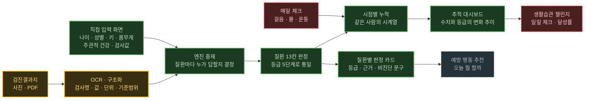
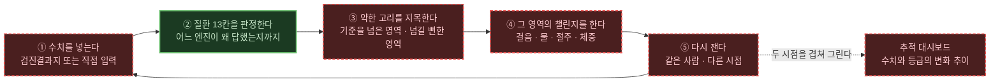
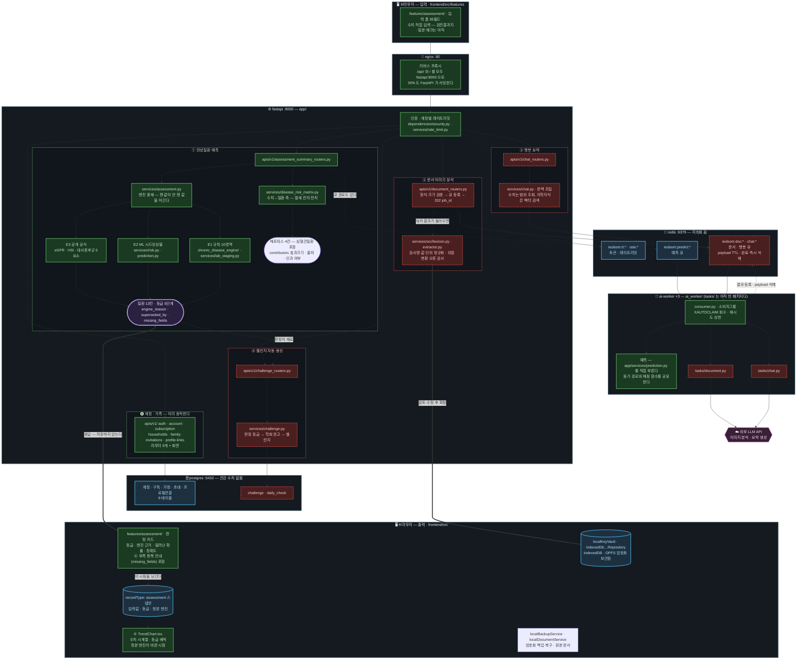
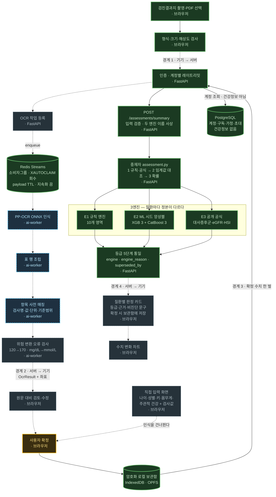
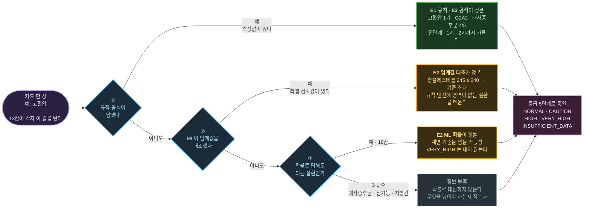

# 33. 핵심 피처 흐름도 — 검진결과지 한 장에서 질환별 판정까지

> 작성일: 2026-08-25 · **갱신: 2026-08-25 오후 (아래 참조)**
> 근거: 2026-08-25 멘토링 — "그 핵심 피쳐 flow chart 작성해보기. 완벽하지 않아도 됩니다! 설명 가능한 형태의 flow chart"
> 전제: [ADR-009](adr/0009-per-disease-models-and-server-inference-path.md) 모델 구조·실행 위치 · [ADR-010](adr/0010-checkup-document-ocr-path.md) 건강문서 인식 경로
> 공백 판정: [32_core_feature_gap_matrix](32_core_feature_gap_matrix.md) · 큐 실측: [35_prediction_queue_and_workers](35_prediction_queue_and_workers.md) · 범위 판정: [36_feature_scope_vs_talos_requirements](36_feature_scope_vs_talos_requirements.md)
> 파싱 검증: 여섯 그림 모두 `@mermaid-js/mermaid-cli` 11.16.0 으로 렌더 확인

**첫 판을 그린 날 오후에 여섯 노드가 색을 바꿨다.** 인증·레이트리밋, Redis 큐, 통합 진입점, 중재자, E3 공식, 등급 통일이 회색에서 초록으로 넘어왔다. 그림이 며칠 만에 낡는다는 사실 자체가 이 문서의 쓸모다 — **낡았다는 걸 알아채려면 그림이 있어야 한다.** 갱신 조건은 §9 에 적어 뒀다.

**그림이 여섯 장이다.** 한 장에 밀어 넣으면 다 흐려진다. 질문이 서로 다르기 때문이다.

| | 형식 | 답하는 질문 | 누가 읽나 |
|---|---|---|---|
| §1 | `flowchart LR` | 이 제품이 **사용자에게 뭘 하나** | 기획·발표·처음 오는 사람 |
| §1 | `flowchart LR` | 필수 기능 셋이 **어떻게 한 고리가 되나** | 기획 |
| §1 | `flowchart TB` | **컨테이너 안에 무엇이 들었나** — 핵심 기능이 어느 파일로 앉나 | 착수 담당자 · 아키텍처 설명 |
| §2 | `sequenceDiagram` | 요청이 **어디를 거쳐 어떤 순서로** 도나 | 인프라·배포 |
| §4 | `flowchart TD` | 무엇이 되고 **무엇이 비었나** | 작업 분배 |
| §5 | `flowchart LR` | 질환 하나가 **왜 그 답을 받았나** | 모델·화면 |

§1 의 배선도와 §2 의 시퀀스는 **같은 대상을 다르게 자른 것**이다. 배선도는 무엇이 무엇 안에 있는지(공간)를, 시퀀스는 무엇이 먼저 일어나는지(시간)를 보여준다. 발표에서는 배선도가, 장애 추적에서는 시퀀스가 쓰인다.

§2 는 멘토가 물은 `nginx → FastAPI → DB → Redis → ai-worker` 에 직답하고, §5 는 "고혈압·당뇨 모델을 각각 둘지 앞단 라우팅일지" 에 직답한다.

## 1. 기능 지도 — 이 제품이 사용자에게 하는 일

앞의 세 장은 전부 엔지니어링 관점이라 **"그래서 이게 뭘 해주는 서비스인데"** 에 답하지 못한다. 이 장이 그 자리다.

색이 곧 판정이다. **빨강은 Talos 트랙의 필수 기능인데 코드가 없는 칸**이다 — 없어서 곤란한 정도가 아니라 평가 항목이 0점이 되는 칸이라 따로 뺐다.



| 색 | 뜻 | 칸 |
|---|---|---|
| 초록 | 동작한다 | 직접 입력 화면, 엔진 중재, 질환 13칸 판정, 시점별 누적, 판정 카드, 추적 대시보드 |
| 주황 | 반쯤 있다 | 검진결과지 입력, OCR·구조화 |
| **빨강** | **Talos 필수인데 없다** | 매일 체크, 생활습관 챌린지 |
| 회색 | Talos 선택, 아직 안 함 | 예방 행동 추천 |

**초록이 한 줄로 이어졌다.** 2026-08-25 오후에 입력 화면 → 판정 → 스냅샷 → 추적 대시보드가 붙어 축 A 가 뚫렸다. 남은 빨강은 **챌린지 한 줄**이고, 그 줄만 Talos 필수 목록에서 비어 있다. 자세한 범위 판정은 [36번 문서](36_feature_scope_vs_talos_requirements.md).

### 세 필수 기능은 따로 있는 게 아니라 하나의 고리다

예측·대시보드·챌린지를 각각 만들면 화면 세 개가 되고 서로 연결이 없다. 순서대로 이으면 하나의 서사가 된다.



**②만 초록이다.** 그리고 ②가 ③의 재료를 이미 다 갖고 있다 — 질환별 등급, 어느 엔진이 답했는지, 무엇이 부족해서 판정을 못 했는지가 응답에 실려 나간다.

한 가지 함정을 미리 적어 둔다. **③의 "약한 고리"를 ML 기여도(`top_factors`)로 뽑으면 안 된다.** 단면 데이터에서 금연·절주가 당뇨 위험을 **올리는** 방향으로 나오기 때문이다(이미 아픈 사람이 끊는다). 챌린지 항목은 학회 권고에서 가져오고, 기여도는 설명 재료로만 쓴다. 근거는 `ConditionRisk.top_factors` 필드 설명과 [21_modeling_overview](21_modeling_overview.md) — "일부 개입은 부호가 뒤집혀 있다. 금연·음주·식단이 당뇨 위험을 올리는 것으로 나온다".

### 목표 배선도 — 컨테이너 전부를 열어 본 한 장

위 두 장이 사용자 관점이라면 이 장은 **같은 것을 파일 경로에 얹은 것**이다. 컨테이너를 상자로 두고 그 안을 다 열었다 — 브라우저에는 화면과 보관함이, `fastapi` 에는 기능 여섯이, `redis` 에는 키 공간이, `postgres` 에는 테이블이, `ai-worker` 에는 태스크가 들어 있다.

팀이 2026-08-25 에 정한 핵심 기능 넷(① 만성질환 예측 · ② LLM 문서 이미지 분석 · ③ 챗봇 요약 · ④ 챌린지 자동 생성)에 ⑤·⑥ 을 더해 그렸다. 추가 근거는 [36번 문서](36_feature_scope_vs_talos_requirements.md) §6.



**브라우저가 위아래로 두 번 나온다.** 같은 컨테이너인데 입력과 출력을 갈랐다 — 한 상자로 두면 앞뒤에서 동시에 당겨져 그림 한가운데로 끌려오고, 그러면 위에서 아래로 읽히지 않는다.

| 색 | 뜻 |
|---|---|
| **초록** | 오늘 실제로 도는 것 — nginx, 인증·레이트리밋, **계정·가족 라우터 6개**, `assessment_summary_routers.py`, `assessment.py`, 세 엔진, **`disease_risk_matrix.py`**, `consumer.py`, `tasks/prediction.py` |
| **빨강 점선** | 아직 없는 자리. 이름은 저장소 명명 규칙(`apis/v1/*_routers.py` → `services/*.py` → `ai_worker/tasks/*.py`)을 그대로 따랐으니 만들 때 그대로 쓰면 된다 |
| 파랑 | 데이터가 실제로 앉는 곳 |
| 보라 | 외부 사업자 |

### 이 그림이 말하는 것 넷

**하나 — 축 A 가 입구에서 출구까지 초록으로 이어졌다.** 2026-08-25 오후에 `features/assessment/` 가 붙어 입력 폼 36필드 → 판정 카드 → 스냅샷 → 추적 대시보드가 생겼다. 남은 빨강은 ② 문서 · ③ 챗봇 · ④ 챌린지이고, 셋 다 화면이 아니라 **기능 자체가 없는** 자리다.

**⑤⑥ 에 서버 라우터가 없는 것은 실수가 아니다.** 첫 판에서는 `apis/v1/timeline_routers.py` 를 그려 뒀는데 만들다 보니 필요가 없었다 — 서버는 판정을 저장하지 않으므로(NFR-01) 시점을 이을 자리가 애초에 로컬 보관함뿐이고, 그러면 조회도 브라우저 안에서 끝난다. 그림에서 상자를 지운 이유가 그것이다. **무저장 정책이 API 하나를 없앤 사례**로 적어 둔다.

**둘 — 기능 넷은 병렬이 아니라 사슬이다.** ②가 ①의 입력(확정 수치)을 만들고, ③·④·⑤·⑥ 이 ①의 출력(`질환 13칸`)을 쓴다. 그림의 `판정이 재료` 화살표가 그 의존이다. 다만 **착수 순서는 사슬 순서가 아니다** — ①이 이미 초록이므로 ④부터 시작하는 것이 맞다. ④는 Talos 필수 칸이고 ①의 출력만 있으면 되는데 그 출력이 이미 나온다.

**셋 — `redis` 상자 안에서 키 공간이 갈려 있다.** 토큰·레이트리밋은 계정 정보고, 큐에는 건강 수치가 흐른다. 그래서 인스턴스 전체의 **지속화를 껐다.** 대가는 재시작 시 전원 재로그인이고, 토큰은 다시 만들면 되지만 건강 수치는 그렇지 않으므로 그 교환을 받아들였다([35번 문서](35_prediction_queue_and_workers.md) §2).

**넷 — `ai_worker/tasks/` 는 아직 빈 패키지다.** 첫 판에서 `tasks/prediction.py` 를 초록으로 그렸는데 **그 파일이 없다.** `consumer.py` 가 `app/services/prediction.py` 를 직접 부르고(동기 라우터와 채점 함수를 공유한다), `tasks/` 에는 빈 `__init__.py` 만 있다. 그림이 없는 모듈 배치를 있다고 말하고 있었다 — 브라우저에 열려 있던 판을 저장소와 한 줄씩 맞춰 보다 발견했다.

**다섯 — `postgres` 상자에 건강 수치가 없다.** 계정·구독·가정·초대와 챌린지 수행 기록뿐이다. 판정 결과는 `질환 13칸` 에서 브라우저로 나가고 어디에도 저장되지 않는다.

**여섯 — ① 안에 초록 상자가 둘이다.** 왼쪽 `assessment.py` 가 열세 칸(장기별 현재 상태)을 내고, 오른쪽 `disease_risk_matrix.py` 가 **그 전치**를 낸다 — 수치 하나가 여러 질환에 걸쳐 무엇을 가리키는지. 두 축을 합치지 않는 이유는 재료가 겹쳐서 합치면 같은 값을 두 번 세기 때문이다. **심혈관질환은 오른쪽 축에만 있다** — 규칙 엔진에도 ML 번들에도 심혈관 타깃이 없다.

**일곱 — ⓿ 상자가 초록인데 Talos 필수 목록에는 없다.** 계정·구독·가정·초대·프로필 연결이 서버와 화면 모두 완성돼 있고, 10개 라우터 중 6개가 여기다. 필수 칸을 채우지는 않지만 평가 항목 5-4(인증·인가)·2-2(확장성)·2-3(아키텍처)의 실물 근거다. 첫 판에서 이 상자를 빼먹어 **동작하는 서버 코드의 절반이 그림에서 사라져 있었다.**

**②는 [ADR-010](adr/0010-checkup-document-ocr-path.md) §2 를 뒤집는 결정이다.** 그 결정문은 멀티모달 직송을 기본 엔진에서 기각하면서 결정타로 "근거 좌표가 없으면 사용자 검토·수정 화면이 성립하지 않는다"를 들었다 — 검사 항목이 30개인 결과지에서 하나가 틀렸을 때 사용자가 그것을 찾을 방법이 사라진다는 뜻이다. 그림의 `services/ocr/lexicon.py · extractor.py` 칸이 그 좌표를 받아 쓰는 자리인데, 직송이면 받을 좌표가 없다. 바꾸려면 ADR-010 을 대체하는 후속 ADR 이 선행이고, 외부 멀티모달 API 는 [ADR-008](adr/0008-temporary-cloud-ocr-baseline.md) 이 Naver CLOVA 만 콕 집어 허용했으므로 그 예외도 새로 써야 한다. 대안은 ADR-010 이 "가장 유망한 후속안" 으로 보류한 **하이브리드** — OCR 이 좌표를 확보하고 LLM 은 정리·정규화만 맡는 구성이다. 36번 문서 §6 참조.

## 2. 인프라 흐름 — 컨테이너별 레인

컬럼이 선언 순서로 고정되고 시간이 위에서 아래로 흐른다. `flowchart` 의 subgraph 는 배치를 엣지가 결정해서 레인 순서를 강제할 수 없다 — 실제로 좌우로 흩어졌다. 그래서 시퀀스로 그렸다.

```mermaid
sequenceDiagram
    autonumber
    actor U as 유저 · 브라우저
    participant N as nginx :80
    participant A as fastapi :8000
    participant D as postgres :5432
    participant R as redis :6379
    participant W as ai-worker ×3

    rect rgb(27,58,34)
    Note over U,W: A. 지금 동작한다 — 기본 4종 + 워커 3대
    U->>N: SPA 로드 · /api/v1/auth
    Note over N: 리버스 프록시만 한다. /api/ 와 / 를 모두 fastapi 로 넘긴다<br/>SPA 는 nginx 가 아니라 FastAPI 가 서빙한다 (spa.mount)<br/>static_volume 을 마운트하지만 conf 가 쓰지 않는다 — 잔재
    N->>A: proxy_pass
    Note over A: 기동 시 alembic upgrade head<br/>모델 번들은 이미지가 아니라 ro 볼륨이다<br/>modeling/artifacts/models → /app/models<br/>재학습해도 이미지 재빌드가 없다
    A->>D: 계정·구독·가정·초대 조회
    Note over D: 9 테이블. 건강정보 없음
    D-->>A: 결과
    A->>R: 리프레시 토큰 · 초대 토큰 · 레이트리밋 카운터
    A-->>U: 화면 + 계정 상태

    U->>A: 경계 3 · POST /api/v1/assessments/summary
    Note over A: 인증 + 계정별 레이트리밋 — ADR-009 §10 선행조건이 붙었다<br/>입력 검증·이름 사상 → 중재자 app/services/assessment.py<br/>E1 규칙 10영역 · E2 ML 20번들 · E3 공개공식<br/>질환 13칸을 등급 5단계로 통일. 메모리에서 채점하고 버린다
    A-->>U: 경계 4 · engine · engine_reason · superseded_by 포함 판정

    U->>A: POST /api/v1/predictions/jobs (선택 — 큐 경로)
    A->>R: XADD ieobom:predict:stream · job 해시 TTL 600s
    Note over R: 지속화를 껐다 (--save "" --appendonly no)<br/>건강 수치가 통과하므로 디스크에 남기지 않는다
    A-->>U: 202 job_id
    R->>W: 소비자 그룹이 한 메시지를 한 대에만 배달
    Note over W: 30건 → 11·10·9 로 분산, 재시도 0<br/>동기 응답과 바이트 단위로 동일 (12,410 B)<br/>XAUTOCLAIM 으로 죽은 워커의 작업을 회수한다
    W->>R: 결과 등록 · payload 즉시 HDEL
    U->>A: GET /predictions/jobs/{job_id}
    A-->>U: status · worker · attempts · result
    end

    rect rgb(58,46,16)
    Note over U,A: B. 반쯤 있다 — 서버는 답하는데 볼 화면이 없다
    Note over U: 판정 카드도 수치 변화 차트도 없다<br/>축 A 의 모델 작업 전부가 사용자에게 도달하지 않는다
    U->>U: 브라우저 Tesseract 로 전체 페이지 → 평문 (서버를 거치지 않는다)
    Note over U: browserOcrAdapter.ts 만 있다<br/>검사명·값·단위 구조화가 없다
    end

    rect rgb(38,50,58)
    Note over U,W: C. 아직 없다 — OCR 서버 경로 (부품은 feat/OCR_n_ai-worker 에)
    U->>N: 경계 1 · 검진결과지 업로드
    N->>A: POST /api/v1/documents/ocr
    A->>R: enqueue job_id + 이미지 payload (TTL 10분)
    A-->>U: 202 job_id
    R->>W: 작업 배달
    Note over W: 큐·소비자그룹·회수·TTL 배선은 예측 큐가 이미 증명했다<br/>인식기를 이식해 tasks/ 에 얹으면 된다<br/>들어가야 할 것 — PP-OCR ONNX 인식 → 표 행 조립<br/>→ 항목 사전 매칭 → 위험 변환 오류 검사
    W->>R: 결과 등록 · payload 즉시 삭제
    U->>A: 상태 조회 (폴링 또는 SSE)
    A-->>U: 경계 2 · OcrResult + 좌표
    Note over U: 원문 대비 검토·수정 → 사용자 확정<br/>암호화 로컬 보관함 (IndexedDB · OPFS)<br/>확정된 수치가 위 A 의 경계 3 으로 들어간다
    end
```



## 3. 도커 스택 실물 — 기본 기동은 4종이다

`docker-compose.yml` 에 서비스가 일곱이지만 프로파일 없이 뜨는 것은 넷이다. 위 그림의 컬럼과 이 표가 같은 대상을 가리킨다.

| 서비스 | 프로파일 | 확인한 사실 |
|---|---|---|
| `nginx` :80 | 없음 (기본) | `/api/` 와 `/` 를 **모두** `fastapi:8000` 으로 넘긴다. SPA 는 nginx 가 아니라 FastAPI 가 서빙한다(`spa.mount`). `static_volume` 을 마운트하지만 conf 가 쓰지 않는다 — 잔재 |
| `fastapi` :8000 | 없음 (기본) | 기동 시 `alembic upgrade head`. 모델 번들을 `modeling/artifacts/models → /app/models:ro` 로 마운트하므로 **재학습해도 이미지 재빌드가 없다.** 규칙 엔진도 ro 마운트 |
| `postgres` :5432 | 없음 (기본) | 9 테이블. 건강정보 없음 |
| `redis` :6379 | 없음 (기본) | 세 역할이다 — 리프레시·초대 토큰, 레이트리밋 카운터, 예측 작업 큐. 건강 수치가 통과하므로 **지속화를 껐다**(`--save "" --appendonly no`). 대가는 재시작 시 전원 재로그인이다 |
| `ai-worker` | `ai` | **돈다.** `consumer.py` 194줄, `--scale ai-worker=3` 으로 3대. 30건을 던지면 11·10·9 로 갈리고 재시도 0. `container_name` 을 빼야 `--scale` 이 된다 |
| `email-worker` | `mail` | 초대 메일 워커. 건강정보 아님 |
| `mailpit` | `mail` | 로컬 SMTP 수신함. 운영 배포 제외 |

**멘토가 말한 다섯이 이제 다 떠 있다.** 첫 판을 쓸 때는 `ai-worker` 하나가 `echo 'hello world'` 껍데기였는데, 그날 오후에 예측 큐로 채워졌다. OCR 은 아직 안 얹혔지만 **배선은 같은 것을 쓴다** — 스트림·소비자그룹·회수·TTL 이 이미 증명됐으므로 인식기만 이식하면 된다.

## 4. 공백 지도 — 노드별 구현 상태

같은 흐름을 세로 한 줄로 펴고 노드마다 색을 입혔다. 노드 옆의 `· 브라우저`·`· FastAPI`·`· ai-worker` 가 실행 위치다.



### 범례

| 표시 | 뜻 | 노드 |
|---|---|---|
| 초록 | 이 브랜치에서 동작한다 | 파일 선택, 사전 검사, **인증·레이트리밋**, **Redis 큐**, 로컬 보관함, **통합 진입점**, **중재자**, E1 규칙, E2 ML, **E3 공식**, **등급 통일**, PostgreSQL |
| 주황 | 한쪽 끝만 붙었다 | 사용자 확정 (저장 계층은 있고 호출부가 없다) |
| 파랑 점선 | 코드는 있는데 **다른 브랜치**에 있다 | PP-OCR 인식, 표 행 조립, 항목 사전 매칭 |
| 회색 점선 | 어디에도 없다 | 직접 입력 화면, OCR 작업 등록, 위험 오류 검사, 검토·수정 화면, 판정 카드, 차트 |

굵게 표시한 여섯이 2026-08-25 오후에 회색에서 초록으로 넘어왔다. 인증·레이트리밋과 Redis 큐가 먼저 붙었고([35번 문서](35_prediction_queue_and_workers.md)), 중재자·E3 공식·등급 통일·통합 진입점이 뒤이어 붙었다.

**남은 회색이 어디에 몰려 있는지가 이제 분명하다.** 서버 쪽 판정 경로는 입구에서 출구까지 초록으로 이어지는데, 그 앞의 **입력 화면**과 뒤의 **결과 화면**이 비어 있다. 지금 부족한 것은 모델 성능도 배선도 아니고 **화면**이다 — 서버가 13칸을 판정해 내보내는데 사용자가 볼 자리가 없다.

파랑 셋은 성격이 다르다. 구현할 것이 아니라 **옮길 것**이고, 그 아래위의 회색(작업 등록·오류 검사·검토 화면)이 옮긴 뒤에 붙일 몫이다.

## 5. 엔진 라우팅 — 질환 하나가 왜 그 답을 받았나

멘토 질문에 직답하는 장이다. **"고혈압·당뇨 모델을 각각 둘지, 앞단 분류기로 라우팅할지"** 에는 서로 다른 두 개가 섞여 있다.

**질환을 고르는 앞단 라우터는 없다.** 고혈압과 당뇨는 동시에 존재할 수 있어 고를 일이 없고, 화면도 카드를 동시에 그린다. 라우터를 두면 오분류가 곧 **카드 누락**이 된다 — 당뇨 카드가 통째로 사라지는 실패는 확률이 조금 틀리는 것과 등급이 다르다. 그래서 13칸이 **각자 독립으로** 아래 길을 탄다.

**라우팅이 걸리는 자리는 엔진이다.** 같은 질환을 두고 세 엔진이 순서대로 답할 기회를 갖는다.



### 왜 이 순서인가

한 줄로 줄이면 **잰 값이 안 잰 값을 이긴다.**

측정값을 학회 임계값과 대조한 결과가 있는데 그 옆에 "넘을 가능성 47%"를 정본으로 두는 건 앞뒤가 맞지 않는다. 게다가 그 확률은 **그 값에 반응하지도 않는다** — 라벨을 만드는 검사값은 해당 질환의 ML 입력에서 차단돼 있기 때문이다. 혈당은 당뇨 모델에, 지질은 이상지질혈증 모델에 들어가지 않는다. 정당한 누출 차단이고 바꾸지 않는다. 대신 값이 들어온 순간 정본을 옮긴다.

①과 ②를 가른 이유는 **자세함**이다. 규칙 엔진은 전단계·1기·2기까지 구간을 가르고 지침 출처와 권고 문구를 함께 낸다. ②는 단일 임계값 통과 여부만 알아 `HIGH`가 상한이다. 그래서 규칙 엔진에 대응 영역이 있으면 그쪽을 먼저 읽고, ②는 **규칙 엔진에 영역이 없는 질환**(고콜레스테롤·고중성지방·낮은 HDL)에서 그 자리를 메운다.

③에서 갈리는 세 질환은 ADR-009 §4 가 정한 예외다. 대사증후군·신기능·지방간은 **공식이 정본**이라 재료가 없으면 확률로 대신하지 않는다. eGFR을 모르는 채로 "만성콩팥병 가능성 12%"를 띄우는 것보다 "크레아티닌을 넣으면 답이 나옵니다"가 정확하다.

**밀려난 값을 지우지 않는다.** ML 확률·백분위·의학등급은 정본이 아니어도 `reference` 에 실려 나가고, `superseded_by` 가 무엇에 밀렸는지 가리킨다. 지우면 화면이 "왜 이 답인가"를 설명할 재료를 잃는다.

### 같은 사람, 검진결과지 한 장 차이

계약 테스트 `test_labs_actually_change_who_answers` 가 고정한 값이다. 54세 남성, 173cm·78kg.

| 질환 | 검사값 없을 때 | 검진결과지를 넣으면 | 무엇이 답을 바꿨나 |
|---|---|---|---|
| 고혈압 | `E2` CAUTION — 선별 추정 | **`E1` HIGH — 고혈압 1기** | 혈압 148/94 |
| 당뇨병 | `E2` NORMAL — 선별 추정 | **`E1` CAUTION — 당뇨병전단계** | 공복혈당 118 · HbA1c 6.1 |
| 고콜레스테롤 | `E2` NORMAL — 선별 추정 | **`E2` HIGH — 기준 초과** | 총콜레스테롤 245 ≥ 240 |
| 대사증후군 | `E3` 정보 부족 (0/5) | **`E3` VERY_HIGH — 5/5 충족** | 허리·TG·HDL·혈압·혈당 |
| 만성콩팥병 | `E3` 정보 부족 | **`E3` CAUTION — G2A2** | 크레아티닌 1.1 · ACR 45 |
| **빈혈** | `E2` NORMAL — 선별 추정 | **`E1` CAUTION — 경증 빈혈** | **혈색소 12.1 (WHO 남성 기준 13.0 미만)** |
| | **8 / 13 판정** | **13 / 13 판정** | |

**빈혈 줄이 이 설계의 존재 이유다.** ML 은 혈색소를 볼 수 없어 확률 3.3%·의학등급 `낮음`을 낸다. 초록 배지다. 그런데 같은 요청에 담긴 혈색소 12.1 은 이미 답을 확정한다. `risk.py` 의 `judge()` 독스트링이 이 상황을 이렇게 적어 뒀다.

> 답을 확정하는 값을 넣었는데 화면이 안심시키는 것이고, 이건 선별 제품에서 가장 비싼 종류의 오류다.

**중재가 붙기 전까지 실제로 그렇게 동작했다.** 규칙은 저 독스트링에 문장으로 다 적혀 있었고 실행하는 코드만 없었다.

### 앙상블은 어디에 있나

멘토 질문의 "앙상블" 은 이 그림에 안 보인다. `E2` 상자 **안에** 있기 때문이다.

앙상블은 질환을 고르는 라우터가 아니라 **같은 질환을 예측하는 멤버들을 합치는 것**이다. 질환 하나당 XGBoost 3시드 + CatBoost 3시드를 평균하고, 그 묶음이 번들 20개(10질환 × 일반형·정밀형)로 나와 있다. 질환 경계를 넘는 스태킹은 기각했다 — 메타러너가 질환 사이로 정보를 옮기면 누출 차단 집합이 뭉개진다.

채택 근거가 판별력이 **아니라는** 점을 적어 둔다. AUROC 로는 중앙 ΔAUROC +0.0020 으로 사실상 0 이다. 산 것은 **재현성**이다. 시드를 바꾸면 개인별 확률이 흔들리는데 이 제품은 그 확률에서 백분위·등급·경보가 전부 파생된다. 평가 항목 3-3(동일 입력 결과 편차 최소화)이 정확히 이 자리다.

## 6. 데이터 경계 — 무엇이 어느 선을 넘는가

§2 의 `경계 1~4` 화살표를 표로 옮겼다. 이 표가 개인정보 설명의 근거다.

| 넘는 것 | 어디서 어디로 | 서버에 남는가 | 근거 |
|---|---|---|---|
| 문서 이미지 바이트 | 브라우저 → FastAPI → Redis → ai-worker | **Redis 에 TTL 10분.** 완료 즉시 삭제, 지속화 끔 | ADR-010 §6 |
| 인식 결과 텍스트 | ai-worker → FastAPI → 브라우저 | 남기지 않음. 로그·APM payload 금지 | ADR-008, ADR-010 §6 |
| 확정 건강 수치 | 브라우저 → FastAPI | 메모리에서 채점하고 응답. DB·Redis·로그 금지 | ADR-009 §10 |
| 질환별 판정 결과 | FastAPI → 브라우저 | 남기지 않음. 확정 저장은 브라우저 보관함 | ADR-009 §10 |
| 계정·구독·초대 | 브라우저 → FastAPI → PostgreSQL | 저장한다. 건강정보 아님 | ADR-002 |
| 합성·비식별 문서 | ai-worker → Naver·VLM | 외부 사업자로 나간다. **채점 비교 목적, 실제 사용자 문서 금지** | ADR-008 |

정리하면 넘는 선이 셋이다. **브라우저 → 서버**는 채점을 위해 넘고 남지 않는다. **서버 → Redis**는 워커가 읽기 위해 넘고 10분 안에 사라진다. **서버 → 외부**는 합성 문서만 넘는다.

Naver CLOVA 와 멀티모달 VLM 직송은 두 그림에서 뺐다. 채점 비교 트랙이라 본 흐름이 아니고, 그리면 세로 줄을 깨뜨린다. 후보 비교는 [16번 문서](16_ocr_cloud_baseline_local_replacement_challenge.md) §4 의 B1~B7 표에 있다.

## 7. 이 그림으로 답하는 멘토 질문

| 질문 | 읽는 곳 |
|---|---|
| 웹서버 → FastAPI → DB → 모델 서버 흐름이 어디인가 | §2 의 컬럼 순서. 모델은 별도 서버가 아니라 `fastapi` 안에서 돈다 — 순수 파이썬 채점이라 홉을 늘릴 이유가 없다 (ADR-009 §9). 실측 왕복 26~29 ms |
| 오래 걸리는 작업의 워커·Redis 는 어디인가 | §2 의 `redis`·`ai-worker` 레인. **예측 큐가 실제로 돈다** — 다만 기본 경로는 여전히 동기다. 단건만 놓고 보면 동기가 8 배 이상 빠르고, 큐가 이기는 자리는 폭주 흡수와 재시도다 (ADR-009 §7 · 35번 문서 §7) |
| 고혈압·당뇨 모델을 각각 둘지, 앞단 라우팅인가 | §4 의 `중재자` 노드. **라우팅은 질환이 아니라 엔진에 걸린다.** E1·E2·E3 가 병렬이고 질환마다 정본 엔진이 다르다. 구현은 `app/services/assessment.py` |
| OCR 따로인가 멀티모달 직송인가 | §2 의 `ai-worker` 노트가 채택 경로다. 직송을 안 쓰는 이유는 §4 의 `검토·수정` 노드가 좌표를 요구하기 때문이다 |
| 로컬 모델의 홈서버·보안·처리량·품질·비용 | §3 의 `ai-worker` 행이 우리 홈서버다. 보안은 §6 표, 처리량은 워커 3대로 30건 1.90 s 까지 쟀다. 큐가 밀리기 시작하는 지점과 OCR 품질·비용은 아직 비어 있다 |

## 8. 챗봇 축을 아직 그리지 않은 이유

넣으면 노드 대부분이 점선이 된다. 저장 위치, 검색 방식, 생성 모델 위치, 대화 기억 계층이 전부 미정이라 그림이 결정을 대신하게 된다. 순서를 지킨다 — 결정이 먼저고 그림이 나중이다.

지금 확실한 것 하나만 적어둔다. 개인 이력은 구조화된 수치 시계열이므로 **벡터 검색이 오히려 나쁠 수 있다.** 인덱스 범위 조회나 툴콜링 DB 조회가 맞을 가능성이 있고, 의학 지식 문서는 벡터 검색이 맞는다. 검색을 두 갈래로 나눠 결정한 다음 §2 에 컬럼을, §4 에 구간을 붙인다.

## 9. 그림을 고쳐야 하는 조건

이미 걸린 것 (2026-08-25 오후 반영 완료).

- ~~`ai-worker` 의 `echo 'hello world'` 가 실제 소비자로 바뀌면~~ → 바뀌었다. `consumer.py` 194줄, 워커 3대.
- ~~중재자 `app/services/assessment.py` 가 구현되면~~ → 구현됐다. §4 의 `중재자` 노드가 초록이다.
- ~~인증·레이트리밋이 붙으면~~ → 붙었다. 예측·판정 세 라우터 전부 `require_active_account` + 계정별 고정창 제한.

아직 걸려 있는 것.

- **판정 카드 화면이 붙으면** §4 의 `F1`·`F2` 가 초록이 된다. 지금 남은 회색의 절반이 여기다.
- **OCR 인식기를 이식하면** §4 의 파랑 셋이 초록으로 넘어오고 `B2`·`C4`·`D1` 이 붙일 자리가 된다.
- Redis payload 4조건 테스트가 실패하면 §2 의 `redis` 레인이 사라지고 동기 중계가 된다 (ADR-010 §6). 현재 12개 테스트 통과 중.
- 채점 데이터셋 결과가 나오면 §3 의 기본 엔진이 교체될 수 있다.
- 챗봇 축의 저장·검색 결정이 나오면 두 그림에 각각 붙인다.
- `GRADE_SOURCE` 를 백분위 사상으로 되돌리기로 하면 §4 의 `등급 5단계 통일` 노트가 바뀐다 (아래 §11).

## 10. 재현

두 그림은 [mermaid.live](https://mermaid.live/) 에 붙여 넣으면 그대로 렌더된다. 다크 테마 기준으로 색을 골랐다. GitHub 는 `.md` 안의 머메이드를 그대로 렌더하므로 이 파일을 푸시하면 도구 없이 보인다.

붙여 넣기 전에 깨지지 않는지 확인하려면 로컬에서 렌더해 볼 수 있다. 이 문서의 두 그림은 이 방법으로 검증했다.

```bash
npx --yes @mermaid-js/mermaid-cli -i diagram.mmd -o diagram.svg
```

## 11. 팀 결정 대기 — 등급 사상이 ADR-009 §5 와 갈렸다

**구현하면서 결정문과 어긋나는 지점이 하나 나왔고, 덮지 않고 남긴다.**

ADR-009 §5 는 ML 을 **동년배 백분위**로 5단계에 사상하라고 적었다 — 백분위 90 이상이면 `HIGH`, 70~90 이면 `CAUTION`. 그런데 같은 저장소가 세 곳에서 그 방식을 쓰지 말라고 적어 두었다.

| 위치 | 적힌 내용 |
|---|---|
| `risk.py` `medical_band()` 독스트링 | "동년배 백분위를 등급에 쓰면 안 되는 이유 — 만성질환 유병률은 나이를 따라 오른다. **70대에서 실제 위험이 높은 사람도 '동년배 이하'** 가 되고 배지가 초록색으로 뜬다" |
| `ConditionRisk.band` 필드 설명 | "**등급 표시에는 쓰지 않는다** — 나이를 나눠 준 상대 위치라 고령자의 절대 위험을 가린다" |
| `ConditionRisk.medical` 필드 설명 | "등급의 정본. 화면 배지는 이걸 쓴다" |

구현은 코드 쪽 논거를 따랐다. `medical_band()` 의 비율(이 점수대 100명 중 몇 명이 학회 기준을 넘는가)을 재료로 쓴다. **두 사상이 실제로 다른 답을 낸다** — 같은 사람이 백분위 95인데 의학 기준 비율은 10%인 경우가 있고, 그때 §5 는 `HIGH`, 구현은 `NORMAL` 을 낸다. 계약 테스트 `test_both_grade_mappings_are_swappable` 이 그 차이를 고정해 둔다.

바꾸는 방법은 `app/services/assessment.py` 의 한 줄이다.

```python
GRADE_SOURCE = grade_from_medical  # 현재
GRADE_SOURCE = grade_from_percentile  # ADR-009 §5 원문
```

**팀이 정할 것.** 코드 쪽 논거가 맞다고 보면 ADR-009 §5 를 개정해야 하고, §5 가 맞다고 보면 위 상수와 함께 세 곳의 코드 주석을 고쳐야 한다. 어느 쪽이든 지금처럼 문서와 코드가 다른 말을 하는 상태로 두지 않는다.

덧붙여 구현이 §5 에 없던 규칙을 하나 더 넣었다. **ML 은 `VERY_HIGH` 를 내지 않는다.** 최고 등급은 "측정값이 진단 기준을 크게 넘었다"는 뜻인데 ML 은 측정을 하지 않았고, 추정에 측정과 같은 배지를 주면 사용자가 둘을 구분할 방법이 없어진다. 이것도 §5 개정 때 같이 적어야 한다.
