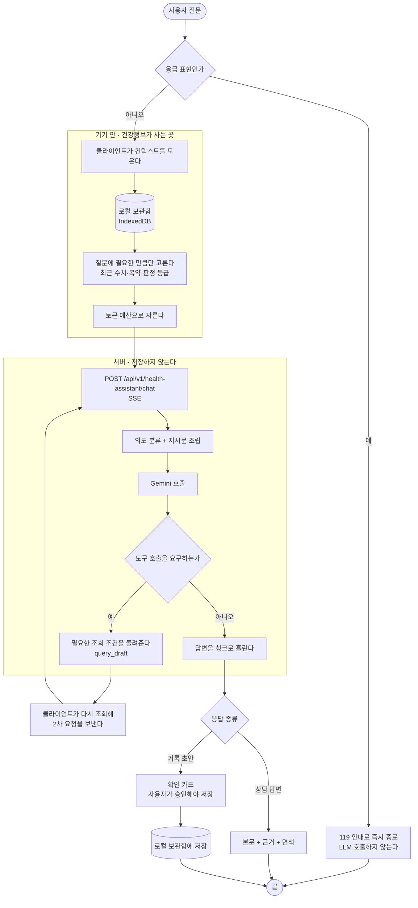

# 43. 챗봇 — 질문에서 역산한 설계와 흐름도

> 작성일: 2026-09-03
> 근거: 2026-08-28 멘토링 — "챗봇이 필요한지 모르겠다", "질문부터 역으로 설계해보기(예상 질문 → 필요한 데이터 선별 → RAG 결정)", "대화 저장·압축", "SSE/polling/streaming 중 어떤 것인지", "flow chart 꼭 만들어보기"
> 파싱 검증: 흐름도는 `@mermaid-js/mermaid-cli` 11 로 렌더 확인
> 선행: [ADR-007 계정별 암호화 로컬 보관함](adr/0007-account-scoped-encrypted-local-vault.md) · [01 요구사항](01_requirements.md) NFR-01 · [40 OCR 큐](40_ocr_queue_pipeline.md)

## 0. 네 줄

- **설계를 가르는 사실은 하나다. 서버에는 건강기록이 없다**(NFR-01). 그래서 서버가 사용자의 과거를 검색하는 RAG 는 애초에 성립하지 않는다. 검색은 기기 안에서 일어나고 서버는 고른 결과만 받는다.
- 예상 질문 21개를 적고 각각에 필요한 데이터를 역산했다. **19개가 구조화 조회로 답해지고 벡터 검색이 필요한 것은 2개뿐**이다. 그 둘은 개인 기록이 아니라 의학 지식이다.
- **지금 필요한 것은 RAG 가 아니라 도구 호출(tool calling)이다.** 개인 이력은 수치 시계열이라 "비슷한 문서 찾기" 가 아니라 "범위 조회" 로 답한다.
- 전송은 **SSE**. OCR 이 이미 같은 방식으로 돌고 있어 인프라가 서 있다.

---

## 1. 먼저 답해야 하는 것 — 챗봇이 필요한가

멘토 지적: "서류 잘못 올렸는지 확인하고 필드 채우게 하는 정도면 챗봇이 필요한지 모르겠다."

맞는 지적이고, **그 용도만이면 필요 없다.** 폼이 낫다. 그런데 지금 붙어 있는 것은 그것만이 아니다.

| 지금 하는 일 | 폼으로 되는가 |
|---|---|
| "어제 30분 걸었어" → 운동 기록 초안 | 폼이 낫다 |
| "혈압 130에 85" → 혈압 기록 초안 | 폼이 낫다 |
| "지난달 혈압 어땠어?" → 조회 조건 추출 | 폼으로도 되지만 대화가 빠르다 |
| **"나 오늘 술 먹어도 돼?"** | **폼으로 안 된다** |

마지막 줄이 챗봇의 존재 이유다. 답하려면 이 사람의 질환·최근 수치·복약·오늘 기록을 한꺼번에 봐야 하고, 그 조합을 미리 화면으로 만들어 둘 수 없다. **질문의 가짓수가 화면의 가짓수보다 많은 지점에서만 챗봇이 이긴다.**

그래서 이 문서는 기록 입력을 챗봇의 목적으로 두지 않는다. **상담이 목적이고 기록은 부수 효과**다.

---

## 2. 예상 질문 21개와 필요한 데이터 역산

실제로 물을 법한 문장을 먼저 적고, 답하는 데 무엇이 필요한지를 뒤에서 채웠다.

### 2.1 즉시 판단형 — "지금 이거 해도 되나"

| # | 질문 | 필요한 데이터 | 지금 있는가 |
|---|---|---|---|
| 1 | 나 오늘 술 먹어도 돼? | 간효소·중성지방 최근값 · 복약(간대사) · 최근 음주 기록 · 판정 등급 | 로컬에 있다 |
| 2 | 이 약 먹고 운동해도 돼? | 복약 목록 · 혈압 최근값 · 저혈당 이력 | 로컬 |
| 3 | 라면 먹어도 될까? | 혈압·신기능 등급 · 나트륨 관련 최근 수치 | 로컬 |
| 4 | 오늘 혈압약 안 먹었는데 지금 먹어도 돼? | 복약 시각 기록 · 약 종류 | 로컬 |
| 5 | 공복인데 혈당 90이면 괜찮은 거야? | 그 수치 + 당뇨 판정 등급 + 기준값 | 로컬 + 규칙 엔진 |

**공통 구조**: (내 최근 수치 몇 개) + (내 판정 등급) + (일반 의학 기준). 앞의 둘은 조회, 뒤는 지식이다.

### 2.2 추이 확인형 — "나 좋아지고 있나"

| # | 질문 | 필요한 데이터 |
|---|---|---|
| 6 | 지난달보다 혈압 좋아졌어? | 혈압 시계열 2구간 집계 |
| 7 | 요즘 살 빠지고 있나? | 체중 시계열 |
| 8 | 운동 얼마나 했지 이번 주? | 운동 기록 합계 |
| 9 | 작년 건강검진이랑 비교하면? | 검진 수치 두 시점 |
| 10 | 혈당 관리 잘되고 있어? | 혈당 시계열 + 목표 범위 |

**전부 범위 집계다.** 벡터 검색이 오히려 나쁘다 — "비슷한 기록" 이 아니라 "그 기간의 전부" 가 필요하다.

### 2.3 판정 해석형 — "이게 무슨 뜻이야"

| # | 질문 | 필요한 데이터 |
|---|---|---|
| 11 | 당뇨 위험 34%가 무슨 뜻이야? | 그 카드의 확률·앵커·정확도 |
| 12 | 왜 고혈압이 의심된다고 나와? | 그 카드의 기여 요인 |
| 13 | 10년 뒤 33%면 심각한 거야? | 궤적 + 동년배 곡선 |
| 14 | 신기능 정보 부족이 왜 떠? | 그 카드의 `missing_fields` |
| 15 | 낮은 HDL은 왜 위험이라고 안 해? | 모델 카드의 한계 문구 |

**전부 방금 만든 응답 안에 있다.** 조회조차 필요 없고 화면이 이미 들고 있는 JSON 을 읽으면 된다.

### 2.4 지식형 — 개인 데이터가 없어도 답한다

| # | 질문 | 필요한 데이터 |
|---|---|---|
| 16 | 당화혈색소가 뭐야? | 의학 지식 |
| 17 | 대사증후군 진단 기준이 어떻게 돼? | 학회 기준 |
| 18 | 고혈압에 좋은 운동은? | 의학 지식 |
| 19 | 크레아티닌이 높으면 뭐가 문제야? | 의학 지식 |

### 2.5 행동형 — 기록·조작

| # | 질문 | 처리 |
|---|---|---|
| 20 | 어제 30분 걸었다고 기록해줘 | 초안 추출 → 확인 카드 → 로컬 저장 |
| 21 | 검진표 올렸는데 제대로 들어갔어? | OCR 결과 조회 |

### 2.6 집계 — 무엇이 실제로 필요한가

| 필요한 것 | 질문 수 | 방식 |
|---|---:|---|
| 내 기록 범위 조회 | 11 | **도구 호출** (로컬 인덱스 범위 질의) |
| 방금 만든 판정 응답 | 5 | 화면이 이미 들고 있다 |
| 의학 지식 | 4 | 프롬프트 상수 또는 **벡터 검색** |
| 기록 쓰기 | 1 | 초안 → 확인 카드 |

**벡터 검색이 필요한 것은 4개뿐이고 그중 2개(16·17번)는 상수표로 충분하다.** 남는 것은 18·19번처럼 열린 질문이고, 이건 개인 기록이 아니라 **의학 지식 문서**다.

---

## 3. 그래서 RAG 를 쓰는가

**개인 이력에는 쓰지 않는다. 의학 지식에는 나중에 쓴다.**

| 대상 | 성질 | 맞는 방법 | 왜 |
|---|---|---|---|
| 내 건강기록 | 구조화된 수치 시계열 | **도구 호출 · 범위 조회** | "비슷한 기록" 이라는 개념이 없다. 2월 혈압을 물으면 2월 전부가 필요하지 유사한 것이 아니다. 임베딩은 숫자의 크기 순서를 보존하지 않는다 |
| 내 판정 결과 | 방금 만든 JSON | **그대로 넣는다** | 검색할 것이 없다 |
| 의학 지식 | 자연어 문서 | 상수표 → (나중에) 벡터 검색 | 질문이 열려 있고 문서가 길다 |

멘토가 공유한 Agentic Retrieval 글의 요지와도 맞는다. "무조건 벡터 DB" 가 아니라 **질문의 성질이 검색 방식을 정한다**는 것이고, 우리 질문의 절반 이상은 검색이 아니라 조회다.

### 3.1 결정적 제약 — 서버는 검색할 것이 없다

NFR-01 이 "서버는 건강정보 원문·원본 서류·OCR 결과·예측 결과를 저장하지 않는다" 로 못 박았고, `app/models/` 에 건강기록 테이블이 실제로 하나도 없다(계정·가구·챌린지·초대·구독뿐).

그래서 **서버 안에 사용자 벡터 DB 를 두는 설계는 요구사항 위반**이다. 조회는 기기 안에서 일어나고, 서버로는 고른 결과만 간다. 지금 `ProfileContext.recent_records_summary` 가 이미 그 모양이다 — 클라이언트가 요약해 실어 보낸다.

---

## 4. 흐름도



**읽는 법 셋.**

1. **안전 검사가 LLM 앞에 있다.** 응급 표현이면 모델을 부르지 않고 즉시 안내한다. 이미 `health_assistant_safety.py` 가 한다.
2. **조회는 기기 안에서만 일어난다.** 서버가 사용자 데이터를 찾으러 가는 화살표가 없다.
3. **도구 호출은 왕복 두 번이다.** 서버가 "무엇이 더 필요한지" 를 돌려주면 클라이언트가 그것만 다시 실어 보낸다. 서버가 직접 못 읽기 때문이고, 이것이 로컬 우선의 대가다.

---

## 5. 전송 방식 — SSE 로 간다

| 방식 | 장점 | 단점 | 판정 |
|---|---|---|---|
| **SSE** | 단방향 스트리밍에 맞고 HTTP 그대로, 프록시·인증 재사용 | 브라우저당 연결 수 제한(HTTP/1.1 6개) | **채택** |
| polling | 가장 단순 | 첫 글자까지 지연, 요청 수 증가 | 대체 경로로만 |
| WebSocket | 양방향 | 양방향이 필요 없다. nginx·인증·재연결을 새로 깔아야 한다 | 기각 |

**근거는 이미 서 있다는 것이다.** 문서 인식이 SSE 로 돌고 있고(`dev_ocr_routers.py`), nginx 설정에 `proxy_http_version 1.1` · `Connection ""` · `keepalive 32` 가 그 때문에 이미 들어가 있다([40번](40_ocr_queue_pipeline.md)). 챗봇은 같은 길을 쓴다.

운영 상수도 OCR 것을 그대로 가져온다 — 폴링 간격 0.25초, 킵얼라이브 15초, 최대 180초.

**한 가지 다르다.** OCR 은 워커가 Redis 에 청크를 싣고 FastAPI 가 그것을 읽어 흘린다. 챗봇은 큐를 타지 않는다 — 응답이 3~8초라 큐의 이득보다 왕복 비용이 크다([ADR-009](adr/0009-per-disease-models-and-server-inference-path.md) §7 이 예측에 대해 같은 판단을 했다).

---

## 6. 대화 저장과 압축

### 6.1 지금 상태

서버는 무상태다. 요청마다 `messages` 를 최대 12개 받고 아무것도 저장하지 않는다. 대화는 클라이언트가 들고 있다.

**이대로 두면 안 되는 이유 둘.** 새로고침하면 사라진다. 12개를 넘으면 앞이 잘리는데 잘리는 규칙이 없다.

### 6.2 결정

| 항목 | 결정 | 근거 |
|---|---|---|
| 어디 저장하나 | **로컬 보관함**(IndexedDB, 계정별 암호화) | 대화에 건강정보가 그대로 들어간다. 서버에 두면 NFR-01 위반이다 |
| 무엇을 저장하나 | 사용자 발화·어시스턴트 답변·의도·저장된 초안 id | 초안 원문은 기록으로 이미 저장되므로 중복하지 않는다 |
| 얼마나 보내나 | 최근 6턴 원문 + 그 앞은 요약 1개 | 12개 그대로 보내면 토큰이 컨텍스트의 대부분을 먹는다 |
| 어떻게 압축하나 | **규칙 기반 먼저** — 오래된 턴에서 (의도, 언급된 수치, 결론)만 남긴다 | LLM 요약은 호출이 한 번 더 늘고 요약 오류가 답에 그대로 들어간다 |
| 언제 압축하나 | 6턴을 넘는 순간 | 시간이 아니라 길이 기준. 예측 가능해야 한다 |
| 지우기 | 대화 단위 삭제 + 보관함 잠금 해제 전에는 안 보임 | ADR-007 |

**규칙 기반 압축의 형태.**

```
[요약] 3턴 전까지: 혈압 기록 2건 저장(2/1 130/85, 2/3 128/80),
       "짜게 먹어도 되냐" 질문에 신기능 등급 근거로 절제 권고
```

수치와 결론만 남기고 문장은 버린다. 이 형태면 LLM 없이 만들 수 있고 무엇이 남고 무엇이 사라지는지 사람이 예측할 수 있다.

---

## 7. 지금 없는 것과 만들 순서

| # | 할 일 | 크기 | 왜 이 순서인가 |
|---|---|---|---|
| 1 | 대화 로컬 저장 스키마 + 6턴 압축 | 중 | 새로고침에 사라지는 것이 가장 눈에 띄는 결함 |
| 2 | SSE 스트리밍으로 전환 | 중 | 지금은 통째로 기다린다. 3~8초 침묵이 가장 큰 체감 문제 |
| 3 | 도구 호출 왕복 (`query_draft` → 재조회 → 2차 요청) | 중 | §2.2 의 11개 질문이 여기서 열린다 |
| 4 | 판정 응답을 컨텍스트에 넣기 | 소 | §2.3 다섯 질문이 즉시 답해진다. 화면이 이미 들고 있다 |
| 5 | 의학 지식 상수표 | 소 | 16·17번 |
| 6 | 벡터 검색 | 대 | 18·19번만 남았을 때 검토한다. **지금은 하지 않는다** |

4번이 가장 값싸고 효과가 크다. 이미 만든 `top_suspects` 와 카드 JSON 을 컨텍스트에 넣기만 하면 "왜 이렇게 나왔어?" 류가 전부 답해진다.

---

## 8. 함께 말해야 하는 한계

- 상담 답변은 진단이 아니다. 안전 수칙은 `health_assistant_safety.py` 가 강제하고 응급 표현은 LLM 앞에서 걸린다.
- 서버가 대화를 저장하지 않으므로 **기기를 바꾸면 대화가 따라오지 않는다.** 백업·복원 흐름을 타야 한다([10 로컬 데이터 계약](10_local_data_contract.md)).
- 컨텍스트를 클라이언트가 고르므로 **고르는 규칙이 곧 답의 품질**이다. 그 규칙은 서버 코드가 아니라 프런트에 있다는 사실을 리뷰에서 놓치기 쉽다.
