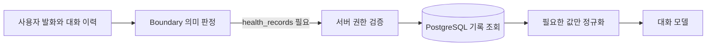
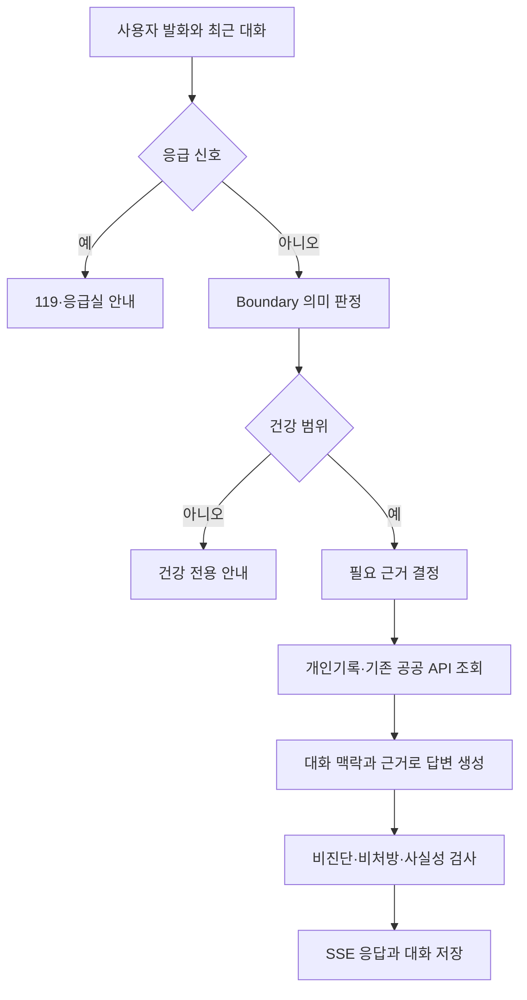

# 43. 건강 챗봇 — 개인 건강정보를 이어서 이해하는 대화 설계

> 최초 작성: 2026-09-03
> 현재 방향 갱신: 2026-09-20
> 성격: 챗봇의 현재 제품 목표와 구현 계약을 설명하는 작업 문서. 아키텍처 정본은 승인 상태의 ADR이다.
> 선행 결정: [ADR-011 PostgreSQL 전환](adr/0011-postgresql-health-data-and-server-ai.md)

## 1. 제품 목표

이어봄의 챗봇은 건강 관련 질문에만 답하는 개인 건강 비서다. 검색 결과를 나열하는 것이 아니라, 인증된 사용자의 건강기록과 앞선 대화를 이해하고 다음 질문까지 자연스럽게 이어서 답한다.

목표는 다음 네 가지다.

1. 사용자의 실제 검사 결과, 측정값, 복약·증상 기록을 질문과 관련 있을 때 사용한다.
2. `왜?`, `그래서?`, `그럼 다른 방법은?`, `하나만 알려줘` 같은 후속 발화를 직전 주제와 연결한다.
3. 확인된 사실과 가능한 설명, 실천 방법을 구분해 구체적으로 답한다.
4. 진단·처방·개인별 안전을 의료진처럼 확정하지 않는다.

건강과 무관한 금융·정치·코딩·연예 질문에는 답하지 않는다. 날씨와 대기질은 야외활동, 폭염·한파, 수분 섭취처럼 건강과 연결되는 경우에만 사용한다.

## 2. 대표 대화 계약

```text
사용자: 내 검사 결과에서 뭐가 제일 안 좋아?
챗봇: 실제 기록의 측정일과 수치를 근거로 먼저 신경 쓸 항목을 설명한다.

사용자: 그럼 이거 왜 그런 거야?
챗봇: 직전 항목을 유지하고, 기록으로 확인된 사실과 가능한 일반 원인을 구분한다.

사용자: 근데 나 운동 진짜 싫어하는데…
챗봇: 같은 건강 목표를 유지하면서 운동 외의 현실적인 대안을 제안한다.

사용자: 그럼 오늘부터 할 수 있는 거 하나만 알려줘.
챗봇: 실행하기 쉬운 행동 정확히 한 가지만 제안한다.
```

이 문장들은 런타임 키워드 목록이 아니다. 표현을 바꿔도 같은 의미와 대화 구조라면 같은 능력이 작동해야 한다.

## 3. 대화 원칙

### 3.1 현재 문장보다 전체 맥락을 본다

- 최근 대화 이력을 함께 전달하고, 대명사와 생략된 대상을 직전 건강 주제에서 찾는다.
- `ㅇ`, `ㅇㅇ`, `ㄱㄱ`, `ㄴㄴ` 같은 짧은 답도 앞선 질문이 있으면 그 맥락으로 해석한다.
- 짧다는 이유만으로 건강 전용 거절 문구를 반환하지 않는다.
- 이유를 물으면 이유를, 대안을 원하면 대안을, 한 가지만 요청하면 한 가지만 답한다.
- 잠시 다른 주제로 전환한 뒤 사용자가 이전 건강 주제를 명시하면 그 지점으로 돌아간다.

### 3.2 예시를 제품 규칙으로 만들지 않는다

임신, 음주, LDL, 러닝은 요구사항을 설명하는 사례일 뿐이다. 사례마다 별도 키워드와 전용 분기를 추가하면 새로운 표현이 나올 때마다 실패한다.

코드가 판단해야 하는 것은 단어의 존재가 아니라 다음 의미다.

- 건강 범위인가
- 기록 작업인가, 일반 정보인가, 개인화된 조언인가
- 어떤 근거가 필요한가
- 앞선 질문에서 이어진 대상과 목적은 무엇인가
- 지금 답할 수 있는가, 한 가지 확인이 필요한가

## 4. 개인 건강정보 사용 원칙

### 4.1 정본과 권한

- 건강기록과 대화의 정본은 PostgreSQL이다(ADR-011).
- 서버가 로그인 계정, 가구 멤버십, 현재 프로필 권한을 검증한다.
- 모델이 `account_id`, `profile_id`, SQL 조건을 임의로 만들지 않는다.
- 클라이언트가 만든 건강기록 요약문을 승인된 개인 건강정보로 신뢰하지 않는다.
- DB 행 전체 대신 질문에 필요한 최신 수치·측정일·기록 종류를 정규화해 전달한다.

### 4.2 의미 판정을 조회 계약으로 사용한다

Boundary가 `health_records`가 필요하다고 판정하면 서버는 표현별 키워드를 다시 검사하지 않고 인증된 프로필 기록을 조회한다.



프런트와 백엔드가 서로 다른 키워드 목록으로 기록 필요 여부를 다시 판단하지 않는다. 새 표현을 지원하기 위해 서비스 코드에 동의어를 계속 추가하지 않는다.

### 4.3 사실과 해석을 구분한다

- 측정일, 검사값, 복약 기록처럼 서버에서 확인한 내용은 사용자 사실로 말할 수 있다.
- 기록에 없는 식습관, 활동량, 체중 변화, 가족력은 사용자 사실처럼 단정하지 않는다.
- 한두 개 수치만으로 질환, 원인, 예후를 확정하지 않는다.
- 시간에 따라 달라질 수 있는 상태는 과거 기록의 날짜를 함께 말하고 현재 상태로 자동 갱신하지 않는다.

## 5. 건강정보와 외부 근거

KDCA는 건강정보를 보강하는 자료 중 하나다. 모든 질문을 KDCA 검색으로 해결하거나, KDCA 검색 결과가 0건이라는 이유만으로 전체 대화를 중단하지 않는다.

- 개인 수치와 기록: 인증된 PostgreSQL 조회 결과를 사용한다.
- 의약품과 병용 정보: 현재 연결된 식약처·DUR 결과가 있으면 우선 사용한다.
- 특정 음식 영양성분: 현재 연결된 식품영양성분 결과가 있으면 우선 사용한다.
- 날씨·대기질·의료시설: 사용자가 실제로 요구한 경우 현재 연결된 공공 API 결과를 사용한다.
- 일반적인 건강 설명: 구체적으로 답하되 가능성과 한계를 함께 설명한다.

공식 자료 조회에 실패했을 때 조회하지 않은 수치나 출처를 만들어내면 안 된다. 그렇다고 모든 질문에 동일한 근거 부족 문구를 반환해서도 안 된다. 확인된 개인 기록, 일반적으로 알려진 원칙, 확인이 필요한 개인 판단을 문장 안에서 구분한다.

새 외부 API를 계속 추가하는 것은 현재 우선순위가 아니다. 먼저 기존 데이터와 대화 흐름을 안정적으로 연결하고, 실제 평가에서 반복되는 정보 공백이 확인될 때만 추가를 검토한다.

## 6. 의료 안전 경계

챗봇은 구체적으로 설명하지만 의료진 역할을 대신하지 않는다.

- `~병입니다`, `무조건 안전합니다`, `반드시 이 약을 드세요`처럼 진단·허가·처방을 확정하지 않는다.
- 가능한 원인은 복수 가능성으로 설명하고 사용자의 실제 원인으로 단정하지 않는다.
- 약과 영양제는 사용자의 상태·복약·알레르기에 따라 달라질 수 있음을 밝힌다.
- 개인별 운동 가능 여부와 강도는 현재 증상과 의료진의 제한 지시를 우선한다.
- 극심한 흉통, 호흡곤란, 의식 저하, 마비, 심한 출혈 등 응급 신호는 생성 모델보다 먼저 고정 안전 경로에서 처리한다.
- 답변마다 같은 면책 문장을 붙이지 않는다. 의료진 확인이 실제로 필요한 지점에 이유와 함께 자연스럽게 안내한다.

## 7. 처리 흐름



Boundary와 생성 모델의 역할을 분리한다. Boundary는 답변을 작성하지 않고 범위, 요청 성격, 필요한 근거, 확인 질문 여부를 구조화한다. 생성 모델은 전체 대화와 서버가 제공한 자료를 사용해 자연어 답변을 만든다.

## 8. 대화 저장과 시간

- 대화 세션과 메시지는 PostgreSQL에 저장한다.
- 모델에는 최근 메시지를 제한된 길이로 전달하되, 아직 해결되지 않은 주제를 잃지 않게 한다.
- 같은 assistant 응답을 두 번 저장하지 않는다.
- 화면에는 메시지 시각을 표시하고 날짜가 바뀌면 날짜 구분선을 표시하는 것을 제품 요구사항으로 둔다.
- 과거 건강 진술에는 해당 메시지나 기록의 기준 시각을 보존한다. 시간이 지났다는 이유만으로 임신 주수, 증상 상태, 복약 상태 등을 자동 확정하지 않는다.

## 9. 관측과 평가

질문 표현에 따라 결과가 달라지는 원인은 다음 순서로 구분한다.

1. Boundary 판정
2. 개인 건강기록과 외부 자료 조회
3. 확보된 Evidence
4. LLM 답변 생성
5. 안전·Grounding 후처리

DEBUG Trace는 단계, 근거 종류, 검색 후보, 결과 개수, 소요시간만 기록한다. 실제 건강 수치, DB 행, 전체 프롬프트와 대화 원문은 운영 로그에 남기지 않는다.

평가는 단일 질문 성공 여부뿐 아니라 같은 의미의 표현 변형과 다중 턴을 함께 본다.

- 개인기록 평가 → 이유 질문 → 제안 거부 → 오늘 행동 한 가지
- 짧은 긍정·부정 답변과 자모 표현
- 건강 대화 중 조건 변경
- 오프토픽 전환과 건강 주제 복귀
- 공식 자료 검색 0건일 때의 정직한 부분 답변
- 기록이 없을 때 수치를 지어내지 않는지

## 10. 현재 우선순위

1. Boundary의 의미 판정과 실제 개인기록 조회를 하나의 계약으로 연결한다.
2. 후속 대화에서 주제와 필요한 근거가 사라지지 않게 한다.
3. 기록 해석 요청을 단순 차트·목록 조회로 돌려보내지 않는다.
4. 표현별 키워드가 아니라 의미가 같은 질문 묶음으로 회귀 테스트한다.
5. 개인화된 답변과 의료적 확답 금지 사이의 경계를 실제 대화로 검증한다.

벡터 DB, LangChain, LangGraph, 새로운 외부 API는 이 우선순위를 해결하지 못하므로 현재 도입하지 않는다.
