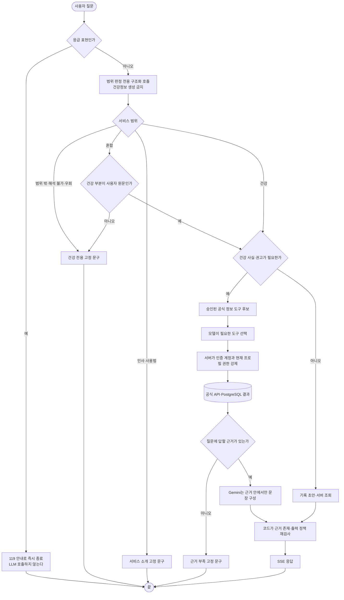

# 43. 챗봇 — 질문에서 역산한 설계와 흐름도

> 작성일: 2026-09-03
> 갱신일: 2026-09-10 — 건강 전용 범위 판정과 공식 근거 강제 정책 반영
> 근거: 2026-08-28 멘토링 — "챗봇이 필요한지 모르겠다", "질문부터 역으로 설계해보기(예상 질문 → 필요한 데이터 선별 → RAG 결정)", "대화 저장·압축", "SSE/polling/streaming 중 어떤 것인지", "flow chart 꼭 만들어보기"
> 파싱 검증: 흐름도는 `@mermaid-js/mermaid-cli` 11 로 렌더 확인
> 선행: [ADR-011 PostgreSQL 전환](adr/0011-postgresql-health-data-and-server-ai.md) · [01 요구사항](01_requirements.md) · [40 OCR 큐](40_ocr_queue_pipeline.md)

## 0. 네 줄

- **건강기록과 대화의 정본은 PostgreSQL이다**(ADR-011). 서버는 로그인 계정의 가구·프로필 권한을 확인한 뒤 필요한 기록만 조회한다.
- 예상 질문 21개를 적고 각각에 필요한 데이터를 역산했다. **17개는 구조화 조회·현재 응답·기록 작업이고, 4개는 공식 의학 지식 검색이 필요하다.**
- **개인 이력에는 RAG보다 서버 집계형 도구 호출(tool calling)이 맞다.** 수치 시계열은 "비슷한 문서 찾기"가 아니라 기간·조건 조회와 정확한 DB 집계로 답한다.
- **인풋 가드레일과 쿼리 빌더 파이프라인을 운영한다.** (1) 0.001초 정규식 하드룰로 비속어·초단문·인젝션을 즉시 차단하고, (2) `QueryAnalyst`로 불완전한 사용자 질문의 숨겨진 맥락과 건강 여부를 분류하며, (3) 부실한 입력을 풍부한 `enriched_query`로 재작성해 도구 호출과 RAG 품질을 극대화한다. 아웃풋 강제 차단으로 인한 먹통은 원상 복구되었다.
- 전송은 **SSE**. OCR 이 이미 같은 방식으로 돌고 있어 인프라가 서 있다.

---

## 1. 먼저 답해야 하는 것 — 챗봇이 필요한가

멘토 지적: "서류 잘못 올렸는지 확인하고 필드 채우게 하는 정도면 챗봇이 필요한지 모르겠다."

맞는 지적이고, **그 용도만이면 필요 없다.** 폼이 낫다. 그런데 지금 붙어 있는 것은 그것만이 아니다.

| 지금 하는 일 | 폼으로 되는가 |
|---|---|
| "어제 30분 걸었어" → 운동 기록 초안 | 폼이 낫다 |
| "혈압 130에 85" → 혈압 기록 초안 | 폼이 낫다 |
| "지난달 혈압 어땠어?" → 조회 조건 추출 | 폼으로도 되지만 대화가 빠르다 |
| **"나 오늘 술 먹어도 돼?"** | **폼으로 안 된다** |

마지막 줄이 챗봇의 존재 이유다. 답하려면 이 사람의 질환·최근 수치·복약·오늘 기록을 한꺼번에 봐야 하고, 그 조합을 미리 화면으로 만들어 둘 수 없다. **질문의 가짓수가 화면의 가짓수보다 많은 지점에서만 챗봇이 이긴다.**

그래서 이 문서는 기록 입력을 챗봇의 목적으로 두지 않는다. **상담이 목적이고 기록은 부수 효과**다.

---

## 2. 예상 질문 21개와 필요한 데이터 역산

실제로 물을 법한 문장을 먼저 적고, 답하는 데 무엇이 필요한지를 뒤에서 채웠다.

### 2.1 즉시 판단형 — "지금 이거 해도 되나"

| # | 질문 | 필요한 데이터 | 지금 있는가 |
|---|---|---|---|
| 1 | 나 오늘 술 먹어도 돼? | 간효소·중성지방 최근값 · 복약(간대사) · 최근 음주 기록 · 판정 등급 | PostgreSQL + 조건부 선조회 |
| 2 | 이 약 먹고 운동해도 돼? | 복약 목록 · 혈압 최근값 · 저혈당 이력 | PostgreSQL + 조건부 선조회 |
| 3 | 라면 먹어도 될까? | 혈압·신기능 등급 · 나트륨 관련 최근 수치 | PostgreSQL + 조건부 선조회 |
| 4 | 오늘 혈압약 안 먹었는데 지금 먹어도 돼? | 복약 시각 기록 · 약 종류 | PostgreSQL + 조건부 선조회 |
| 5 | 공복인데 혈당 90이면 괜찮은 거야? | 그 수치 + 당뇨 판정 등급 + 기준값 | PostgreSQL + 규칙 엔진 |

**공통 구조**: (내 최근 수치 몇 개) + (내 판정 등급) + (일반 의학 기준). 앞의 둘은 조회, 뒤는 지식이다.

### 2.2 추이 확인형 — "나 좋아지고 있나"

| # | 질문 | 필요한 데이터 |
|---|---|---|
| 6 | 지난달보다 혈압 좋아졌어? | 혈압 시계열 2구간 집계 |
| 7 | 요즘 살 빠지고 있나? | 체중 시계열 |
| 8 | 운동 얼마나 했지 이번 주? | 운동 기록 합계 |
| 9 | 작년 건강검진이랑 비교하면? | 검진 수치 두 시점 |
| 10 | 혈당 관리 잘되고 있어? | 혈당 시계열 + 목표 범위 |

**전부 범위 집계다.** 벡터 검색이 오히려 나쁘다 — "비슷한 기록" 이 아니라 "그 기간의 전부" 가 필요하다.

### 2.3 판정 해석형 — "이게 무슨 뜻이야"

| # | 질문 | 필요한 데이터 |
|---|---|---|
| 11 | 당뇨 위험 34%가 무슨 뜻이야? | 그 카드의 확률·앵커·정확도 |
| 12 | 왜 고혈압이 의심된다고 나와? | 그 카드의 기여 요인 |
| 13 | 10년 뒤 33%면 심각한 거야? | 궤적 + 동년배 곡선 |
| 14 | 신기능 정보 부족이 왜 떠? | 그 카드의 `missing_fields` |
| 15 | 낮은 HDL은 왜 위험이라고 안 해? | 모델 카드의 한계 문구 |

**전부 방금 만든 응답 안에 있다.** 조회조차 필요 없고 화면이 이미 들고 있는 JSON 을 읽으면 된다.

### 2.4 지식형 — 개인 데이터가 없어도 답한다

| # | 질문 | 필요한 데이터 |
|---|---|---|
| 16 | 당화혈색소가 뭐야? | 의학 지식 |
| 17 | 대사증후군 진단 기준이 어떻게 돼? | 학회 기준 |
| 18 | 고혈압에 좋은 운동은? | 의학 지식 |
| 19 | 크레아티닌이 높으면 뭐가 문제야? | 의학 지식 |

### 2.5 행동형 — 기록·조작

| # | 질문 | 처리 |
|---|---|---|
| 20 | 어제 30분 걸었다고 기록해줘 | 초안 추출 → 자동/확인 흐름 → 전용 기록 API |
| 21 | 검진표 올렸는데 제대로 들어갔어? | OCR 결과 조회 |

### 2.6 집계 — 무엇이 실제로 필요한가

| 필요한 것 | 질문 수 | 방식 |
|---|---:|---|
| 내 기록 범위 조회 | 11 | **읽기 전용 도구 호출** (PostgreSQL 조건·집계 질의) |
| 방금 만든 판정 응답 | 5 | 화면이 이미 들고 있다 |
| 의학 지식 | 4 | **승인된 공공 건강정보 API 검색** |
| 기록 쓰기 | 1 | 초안 → 확인 카드 |

의학 지식은 프롬프트 상수나 모델의 기억으로 채우지 않는다. 16~19번 모두 KDCA 등 승인된 공공 건강정보에서 관련 문서를 검색하고, 검색 근거가 없으면 답변하지 않는다. 벡터 검색은 이 공공 문서 검색의 재현율이 부족하다는 평가 결과가 나온 뒤 비교한다.

---

## 3. 그래서 RAG 를 쓰는가

**개인 이력에는 쓰지 않는다. 의학 지식에는 승인된 공공 문서 검색을 쓴다.**

| 대상 | 성질 | 맞는 방법 | 왜 |
|---|---|---|---|
| 내 건강기록 | 구조화된 수치 시계열 | **도구 호출 · 범위 조회** | "비슷한 기록" 이라는 개념이 없다. 2월 혈압을 물으면 2월 전부가 필요하지 유사한 것이 아니다. 임베딩은 숫자의 크기 순서를 보존하지 않는다 |
| 내 판정 결과 | 방금 만든 JSON | **그대로 넣는다** | 검색할 것이 없다 |
| 의학 지식 | 자연어 문서 | **KDCA 등 승인된 API 검색 → 근거 구간 전달** | 모델의 사전학습 지식이 아니라 출처가 확인된 문서로 답한다 |

멘토가 공유한 Agentic Retrieval 글의 요지와도 맞는다. "무조건 벡터 DB" 가 아니라 **질문의 성질이 검색 방식을 정한다**는 것이고, 우리 질문의 절반 이상은 검색이 아니라 조회다.

### 3.1 결정적 제약 — 권한과 계산은 서버가 책임진다

ADR-011 이후 건강기록은 PostgreSQL에 저장된다. 따라서 기간이 길거나 조건·집계가 필요한 질문은 서버가 직접 처리할 수 있다. 다만 LLM이 `account_id`나 `profile_id`를 정하게 두지 않는다. 계정은 인증 세션에서, 현재 프로필은 클라이언트 요청에서 받아 서버가 가구 멤버십을 재검증한다.

Issue #102의 첫 수직 범위는 `query_health_records` 하나다. 허용된 `record_type`·`metric`·`operator`만 쿼리 빌더에 전달하고, PostgreSQL이 한국 시간 기준 날짜 중복 제거·횟수·최근 결과를 계산한다. 원본 수백 건 대신 압축된 집계와 최대 5건만 모델에 전달하며, 평문 로그에는 인자와 결과를 남기지 않는다.

### 3.2 서비스 범위와 근거 경계

범위 판정과 건강 답변 생성을 분리한다. 첫 모델 호출은 `health`·`service_usage`·`mixed`·`out_of_scope`·`unrecognized`·`prompt_attack` 중 하나만 구조화해 반환하며 건강정보를 생성하지 않는다. 코드가 그 판정을 검증해 범위 밖 입력을 고정 문구로 종료한다.

- 응급 검사는 범위 판정보다 먼저 실행한다. 범위 밖 질문과 응급 표현이 섞여도 119 안내를 놓치지 않는다.
- 인사와 사용법은 코드에 고정한 서비스 소개로 답하고, 범위 밖·해석 불가·지침 우회는 하나의 건강 전용 안내 문구로 끝낸다.
- 혼합 질문은 모델의 요약문을 신뢰하지 않는다. `allowed_health_request`가 마지막 사용자 원문에 실제 포함된 정확한 부분 문자열일 때만 그 건강 부분을 후속 처리한다.
- 건강 사실·수치·해석·권고가 필요한 질문은 승인된 도구 결과가 하나도 없으면 메인 답변 생성 전에 종료한다.
- 판정기는 필요한 근거를 `health_knowledge`·`medication`·`food_nutrition`·`outdoor`·`facility`·`health_records`의 복수 목록으로 반환한다. 코드가 전부 충족됐는지 검사하므로 날씨 결과 하나로 질환 기준까지 답하는 식의 근거 대체를 허용하지 않는다.
- 모델 응답의 `health_advice`와 챌린지 추천은 도구 결과 존재 여부를 코드가 다시 검사한다. 모델이 근거가 있다고 주장하는 것만으로는 통과하지 않는다.
- 허용 근거는 인증된 사용자 기록, 공식 외부 API 결과, 서버의 고정 안전 정책이다. 사용자 기록은 사실 조회에는 쓸 수 있지만 공식 지식 근거 없이 의학적으로 해석할 수 없다.

현재 공식 근거로 인정하는 외부 결과는 식약처 식품영양성분·의약품/DUR, 공공 의료시설, 기상·대기질과 서버 건강기록 집계다. KDCA 건강정보 검색은 다음 수직 범위에서 추가한다. 그 전까지 일반 질환·치료·운동·식이 질문은 근거 부족 안내로 종료하는 것이 의도한 실패 방식이다.

---

## 4. 흐름도



**읽는 법 넷.**

1. **안전 검사가 LLM 앞에 있다.** 응급 표현이면 모델을 부르지 않고 즉시 안내한다. 이미 `health_assistant_safety.py` 가 한다.
2. **범위 판정 모델은 답하지 않는다.** 판정 DTO만 반환하고 실제 허용·차단은 코드가 결정한다.
3. **건강정보는 공식 근거가 있어야 한다.** 근거가 없으면 Gemini 답변을 만들지 않거나 폐기한다.
4. **ID와 계산을 모델에 맡기지 않는다.** 권한은 서버가 검증하고 일수·횟수·최댓값 계산은 PostgreSQL이 끝낸다.

---

## 5. 전송 방식 — SSE 로 간다

| 방식 | 장점 | 단점 | 판정 |
|---|---|---|---|
| **SSE** | 단방향 스트리밍에 맞고 HTTP 그대로, 프록시·인증 재사용 | 브라우저당 연결 수 제한(HTTP/1.1 6개) | **채택** |
| polling | 가장 단순 | 첫 글자까지 지연, 요청 수 증가 | 대체 경로로만 |
| WebSocket | 양방향 | 양방향이 필요 없다. nginx·인증·재연결을 새로 깔아야 한다 | 기각 |

**근거는 이미 서 있다는 것이다.** 문서 인식이 SSE 로 돌고 있고(`dev_ocr_routers.py`), nginx 설정에 `proxy_http_version 1.1` · `Connection ""` · `keepalive 32` 가 그 때문에 이미 들어가 있다([40번](40_ocr_queue_pipeline.md)). 챗봇은 같은 길을 쓴다.

운영 상수도 OCR 것을 그대로 가져온다 — 폴링 간격 0.25초, 킵얼라이브 15초, 최대 180초.

**한 가지 다르다.** OCR 은 워커가 Redis 에 청크를 싣고 FastAPI 가 그것을 읽어 흘린다. 챗봇은 큐를 타지 않는다 — 응답이 3~8초라 큐의 이득보다 왕복 비용이 크다([ADR-009](adr/0009-per-disease-models-and-server-inference-path.md) §7 이 예측에 대해 같은 판단을 했다).

---

## 6. 대화 저장과 압축

### 6.1 지금 상태

대화 세션과 메시지는 서버 PostgreSQL에 저장되고, 클라이언트는 일시 장애 복구용 캐시를 함께 사용한다. 요청 시 모델에는 최근 메시지 최대 12개만 전달한다.

### 6.2 결정

| 항목 | 결정 | 근거 |
|---|---|---|
| 어디 저장하나 | **PostgreSQL `chat_sessions`·`chat_messages`** | 같은 계정의 PC·모바일에서 세션을 이어갈 수 있다 |
| 무엇을 저장하나 | 사용자 발화·어시스턴트 답변·구조화 응답 메타데이터 | 조회 카드와 초안이 다음 대화 뒤에도 유지된다 |
| 얼마나 보내나 | 최근 메시지 최대 12개 | 저장 전체와 모델 컨텍스트를 분리한다 |
| 장애 시 | 클라이언트 세션 캐시로 대화를 계속한다 | 세션 저장 장애가 챗봇 자체를 막지 않는다 |
| 지우기 | 인증된 프로필 권한 확인 후 대화 단위 삭제 | 다른 가구·프로필 세션 접근을 막는다 |

장기 대화 압축은 아직 구현 범위가 아니다. 도입한다면 원문을 임의 요약하기보다 수치와 결론을 분리한 규칙 기반 형태부터 검토한다.

```
[요약] 3턴 전까지: 혈압 기록 2건 저장(2/1 130/85, 2/3 128/80),
       "짜게 먹어도 되냐" 질문은 공식 식이 근거 미조회로 답변 보류
```

---

## 7. 현재 구현 순서

| # | 할 일 | 상태 | 왜 이 순서인가 |
|---|---|---|---|
| 1 | 응급 선행 → 서비스 범위 판정 → 공식 근거 존재 검사 | 구현 | KDCA를 붙이기 전에 모델 사전지식이 새는 경로부터 닫는다 |
| 2 | KDCA 건강정보 검색·상세 응답 계약 확인과 어댑터 | 다음 | HTML 구조와 승인 콘텐츠 범위를 실측해야 안정적인 DTO를 정할 수 있다 |
| 3 | `search_kdca_health_info` 도구와 출처 DTO | 예정 | 일반 질환·치료·검사·자가관리 질문의 공식 근거를 채운다 |
| 4 | 모든 읽기 전용 도구를 통합 레지스트리로 제공 | 예정 | 기능별 키워드 선필터를 없애고 모델이 복수 도구를 선택하게 한다 |
| 5 | 범위·도구 선택·검색 적합성 평가셋 | 예정 | 단순 성공 여부가 아니라 오분류율과 검색 근거 적합성을 측정한다 |
| 6 | 벡터 검색 비교 | 보류 | KDCA 기본 검색의 실패 사례와 평가값이 쌓인 뒤에만 도입한다 |

`query_health_records`의 첫 혈압 집계 수직 범위는 구현되어 있다. 다른 개인 기록 지표 확장은 KDCA 지식 검색과 독립적으로 같은 권한·집계 계약을 재사용한다.

---

## 8. 함께 말해야 하는 한계

- 상담 답변은 진단이 아니다. 안전 수칙은 `health_assistant_safety.py` 가 강제하고 응급 표현은 LLM 앞에서 걸린다.
- 장기 조회는 현재 수축기 혈압의 개월 단위 `gt`·`gte` 집계만 지원한다. 다른 지표나 임의 날짜 범위는 허용 목록과 테스트를 추가한 뒤 확장한다.
- 서버 집계 결과는 관찰된 기록의 개수일 뿐 추세나 진단이 아니다. 답변은 "높은 혈압이 반복되면 기록을 의료진과 공유"하는 수준을 넘지 않는다.
